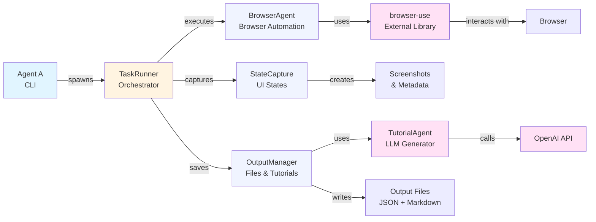
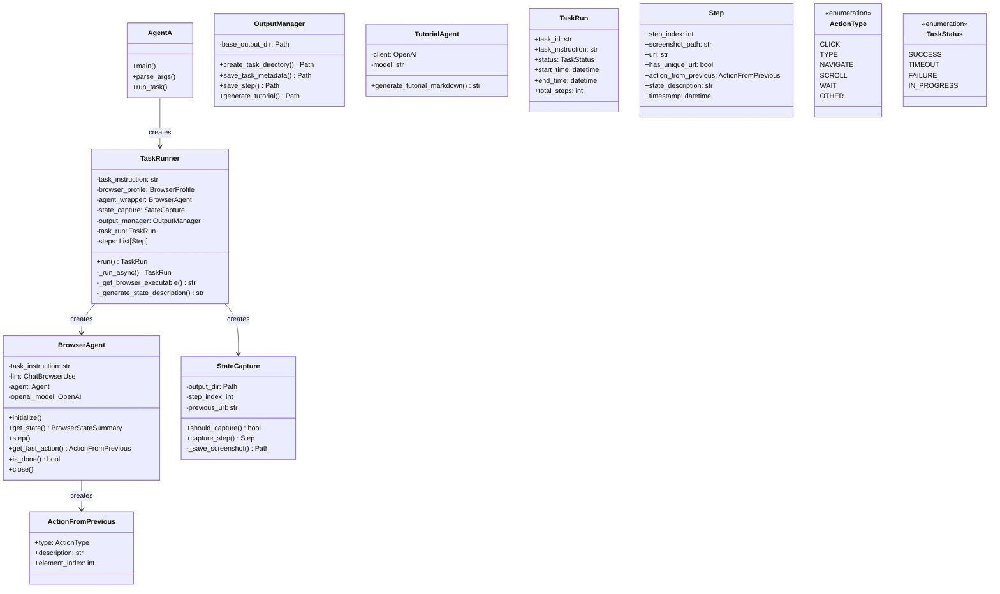
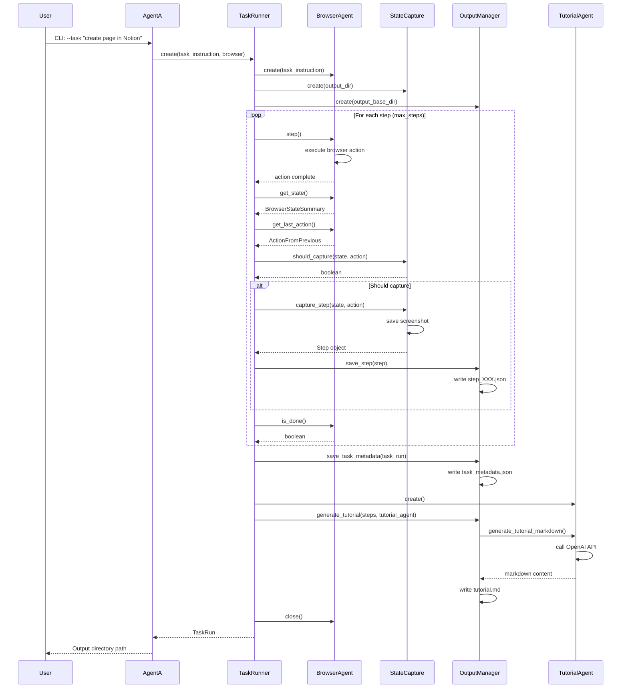

# Architecture Diagram

## System Architecture

```mermaid
graph LR
    A[Agent A<br/>CLI] -->|spawns| B[TaskRunner<br/>Orchestrator]
    
    B -->|executes| C[BrowserAgent<br/>Browser Automation]
    B -->|captures| D[StateCapture<br/>UI States]
    B -->|saves| E[OutputManager<br/>Files & Tutorials]
    
    C -->|uses| F[browser-use<br/>External Library]
    E -->|uses| G[TutorialAgent<br/>LLM Generator]
    
    G -->|calls| H[OpenAI API]
    F -->|interacts with| I[Browser]
    
    D -->|creates| J[Screenshots<br/>& Metadata]
    E -->|writes| K[Output Files<br/>JSON + Markdown]
    
    style A fill:#e1f5ff
    style B fill:#fff4e1
    style C fill:#f0f4ff
    style D fill:#f0f4ff
    style E fill:#f0f4ff
    style G fill:#ffe1f5
    style F fill:#ffe1f5
    style H fill:#ffe1f5
```

## Class Relationships

```mermaid
classDiagram
    class AgentA {
        +main()
        +parse_args()
        +run_task()
    }

    class TaskRunner {
        -task_instruction: str
        -browser_profile: BrowserProfile
        -agent_wrapper: BrowserAgent
        -state_capture: StateCapture
        -output_manager: OutputManager
        -task_run: TaskRun
        -steps: List[Step]
        +run() TaskRun
        -_run_async() TaskRun
        -_get_browser_executable() str
        -_generate_state_description() str
    }

    class BrowserAgent {
        -task_instruction: str
        -llm: ChatBrowserUse
        -agent: Agent
        -openai_model: OpenAI
        +initialize()
        +get_state() BrowserStateSummary
        +step()
        +get_last_action() ActionFromPrevious
        +is_done() bool
        +close()
    }

    class StateCapture {
        -output_dir: Path
        -step_index: int
        -previous_url: str
        +should_capture() bool
        +capture_step() Step
        -_save_screenshot() Path
    }

    class OutputManager {
        -base_output_dir: Path
        +create_task_directory() Path
        +save_task_metadata() Path
        +save_step() Path
        +generate_tutorial() Path
    }

    class TutorialAgent {
        -client: OpenAI
        -model: str
        +generate_tutorial_markdown() str
    }

    class TaskRun {
        +task_id: str
        +task_instruction: str
        +status: TaskStatus
        +start_time: datetime
        +end_time: datetime
        +total_steps: int
    }

    class Step {
        +step_index: int
        +screenshot_path: str
        +url: str
        +has_unique_url: bool
        +action_from_previous: ActionFromPrevious
        +state_description: str
        +timestamp: datetime
    }

    class ActionFromPrevious {
        +type: ActionType
        +description: str
        +element_index: int
    }

    class ActionType {
        <<enumeration>>
        CLICK
        TYPE
        NAVIGATE
        SCROLL
        WAIT
        OTHER
    }

    class TaskStatus {
        <<enumeration>>
        SUCCESS
        TIMEOUT
        FAILURE
        IN_PROGRESS
    }

    AgentA --> TaskRunner : creates
    TaskRunner --> BrowserAgent : creates
    TaskRunner --> StateCapture : creates
    BrowserAgent --> ActionFromPrevious : creates

```

## Data Flow

```mermaid
sequenceDiagram
    participant User
    participant AgentA
    participant TaskRunner
    participant BrowserAgent
    participant StateCapture
    participant OutputManager
    participant TutorialAgent

    User->>AgentA: CLI: --task "create page in Notion"
    AgentA->>TaskRunner: create(task_instruction, browser)
    
    TaskRunner->>BrowserAgent: create(task_instruction)
    TaskRunner->>StateCapture: create(output_dir)
    TaskRunner->>OutputManager: create(output_base_dir)
    
    loop For each step (max_steps)
        TaskRunner->>BrowserAgent: step()
        BrowserAgent->>BrowserAgent: execute browser action
        BrowserAgent-->>TaskRunner: action complete
        
        TaskRunner->>BrowserAgent: get_state()
        BrowserAgent-->>TaskRunner: BrowserStateSummary
        
        TaskRunner->>BrowserAgent: get_last_action()
        BrowserAgent-->>TaskRunner: ActionFromPrevious
        
        TaskRunner->>StateCapture: should_capture(state, action)
        StateCapture-->>TaskRunner: boolean
        
        alt Should capture
            TaskRunner->>StateCapture: capture_step(state, action)
            StateCapture->>StateCapture: save screenshot
            StateCapture-->>TaskRunner: Step object
            TaskRunner->>OutputManager: save_step(step)
            OutputManager->>OutputManager: write step_XXX.json
        end
        
        TaskRunner->>BrowserAgent: is_done()
        BrowserAgent-->>TaskRunner: boolean
    end
    
    TaskRunner->>OutputManager: save_task_metadata(task_run)
    OutputManager->>OutputManager: write task_metadata.json
    
    TaskRunner->>TutorialAgent: create()
    TaskRunner->>OutputManager: generate_tutorial(steps, tutorial_agent)
    OutputManager->>TutorialAgent: generate_tutorial_markdown()
    TutorialAgent->>TutorialAgent: call OpenAI API
    TutorialAgent-->>OutputManager: markdown content
    OutputManager->>OutputManager: write tutorial.md
    
    TaskRunner->>BrowserAgent: close()
    TaskRunner-->>AgentA: TaskRun
    AgentA-->>User: Output directory path
```

