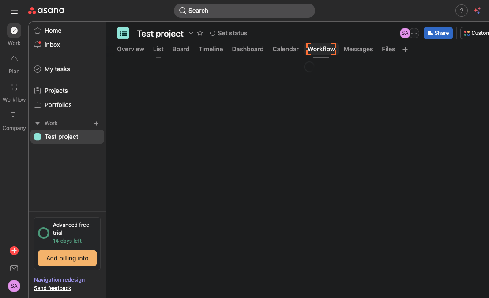
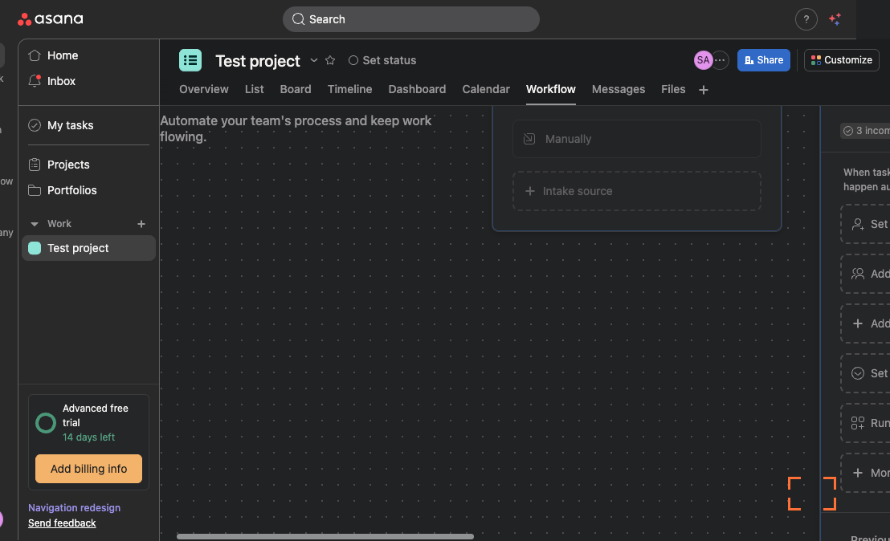
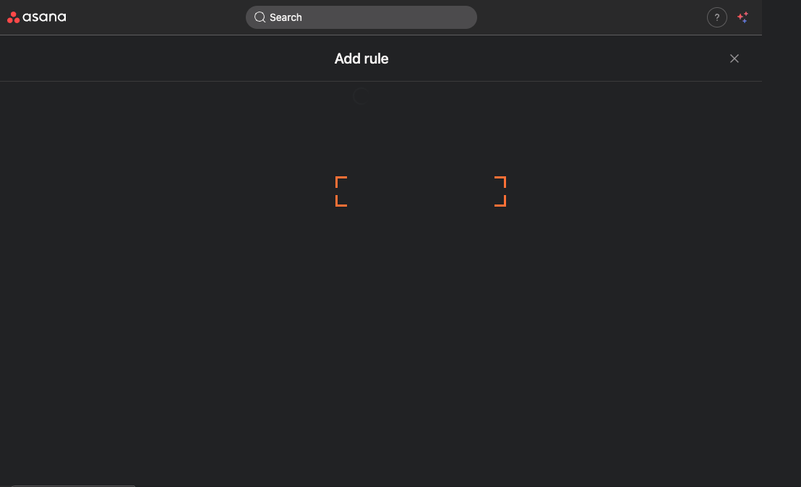
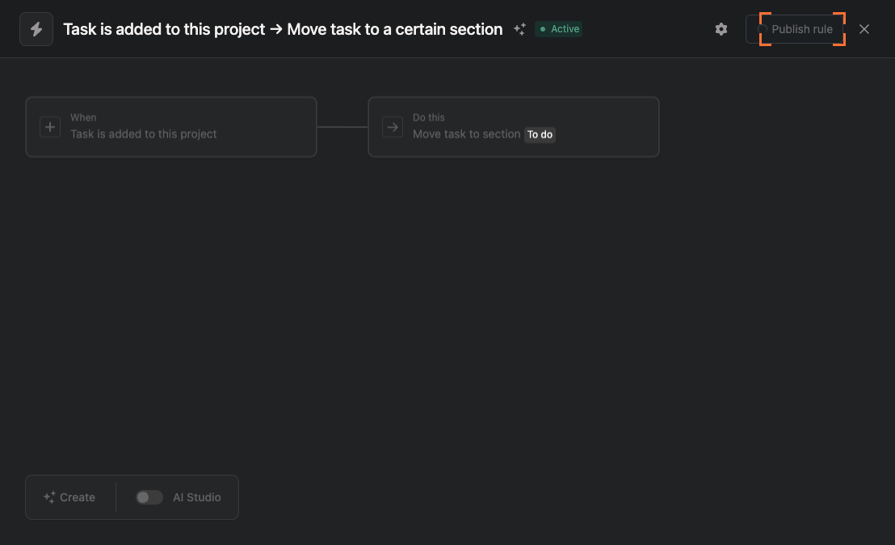

# Create a Workflow in Asana: Build and Publish a Simple Rule

In this tutorial, you’ll learn how to create and publish a basic workflow rule in an Asana project. We’ll navigate to the Workflow tab, add a trigger that runs when a task is added to the project, and publish the rule so it’s active for your team.

## What you’ll accomplish
- Open a project and access the Workflow tab
- Add a trigger for moving tasks automatically
- Publish the rule and confirm it’s active

---

## Step 1: Open your target project
- In the left sidebar, click the project named “Test project” to open it.
- You should see the project header with tabs like List, Board, Timeline, and Workflow at the top.

---

## Step 2: Go to the Workflow tab
- At the top of the project, click the tab labeled “Workflow.”
- This opens the Workflow builder where you can create automation rules for the project.

---

## Step 3: Dismiss any intro or tour
- If a welcome or help dialog appears, click the “Skip” button to proceed.
- You should now see the workflow canvas with prompts to add triggers and actions.

---

## Step 4: Start adding a trigger
- On the workflow canvas, click the button labeled “Add trigger to move tasks to…” (located near the section or stage where you want tasks moved).
- This opens the list of available triggers.

---

## Step 5: Choose “Task is added to this project”
- In the trigger options, click “Task is added to this project.”
- You’ll enter the rule editor showing your selected trigger; Asana will associate this with moving tasks to the chosen section or stage.

---

## Step 6: Publish the rule
- In the rule editor, click the “Publish rule” button (usually at the bottom right).
- Expect to see a confirmation indicating the rule was published successfully.

---

## Step 7: Return to the workflow overview
- Click the close button (X) at the top right of the rule editor to return to the Workflow tab view for the project.
- You should land back on the workflow canvas with your newly published rule visible.

---

## Step 8: Confirm the workflow is active
- Verify that the rule appears in the workflow view and shows as published/active.
- From now on, when a task is added to this project, it will automatically follow the rule you just created.

---

## Summary
You’ve created and published an Asana workflow rule that triggers when a task is added to your project. Using the Workflow tab, you can add more triggers and actions to automate task routing, notifications, and updates—helping your team save time and stay organized.