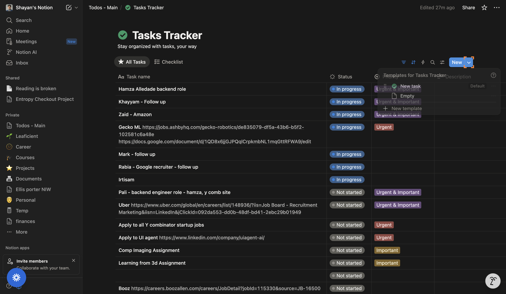
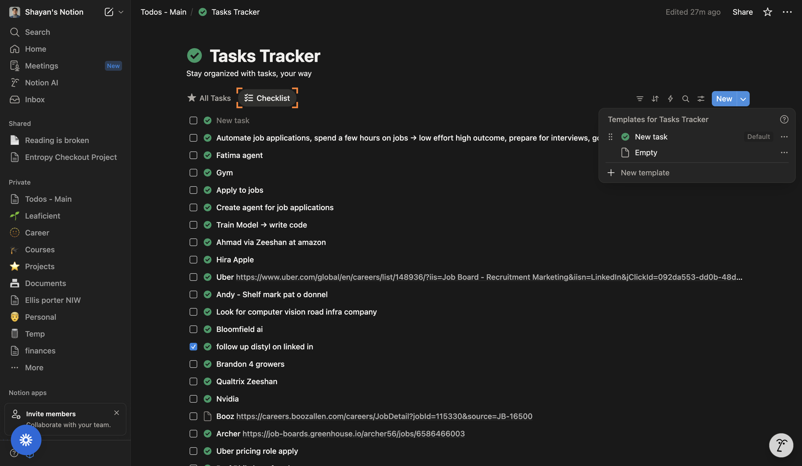
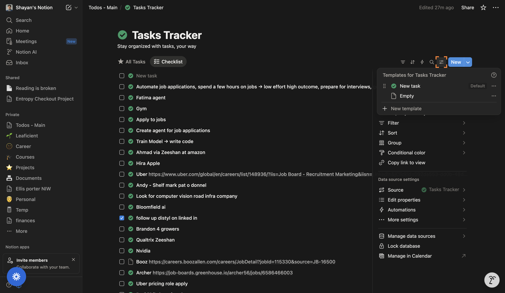
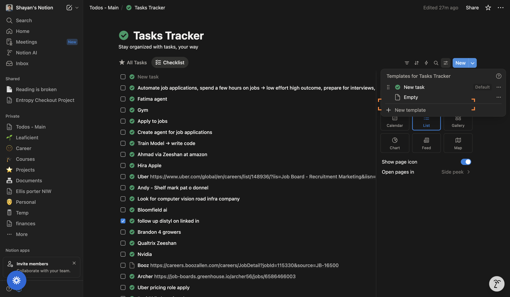
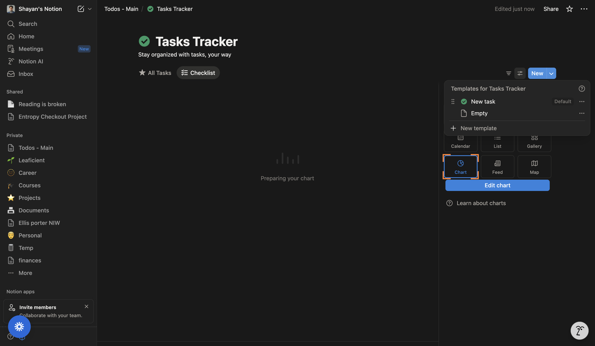
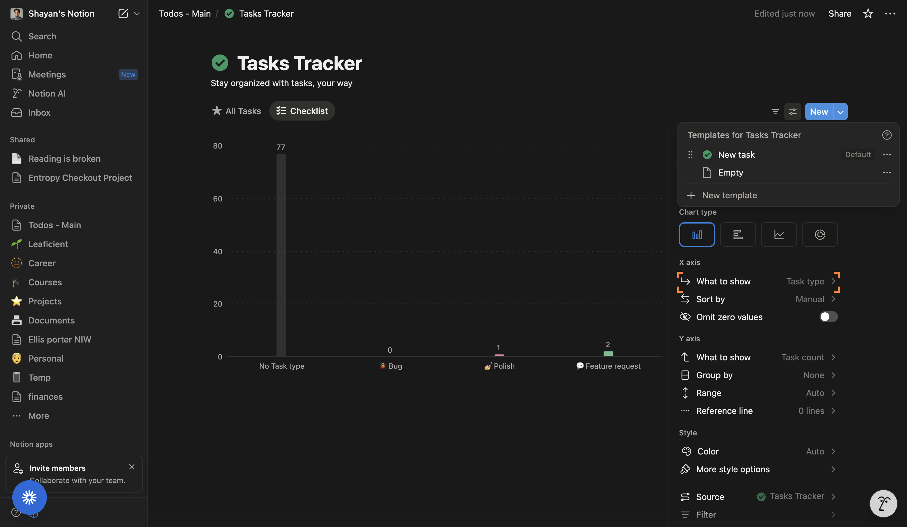
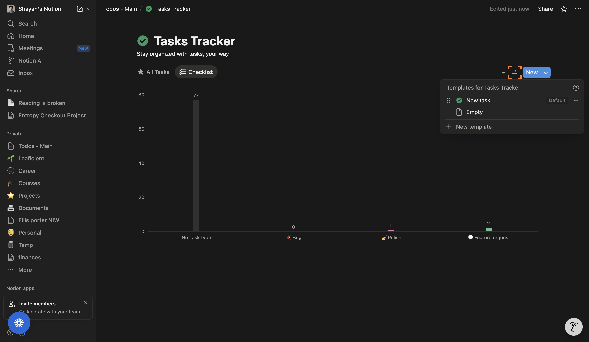
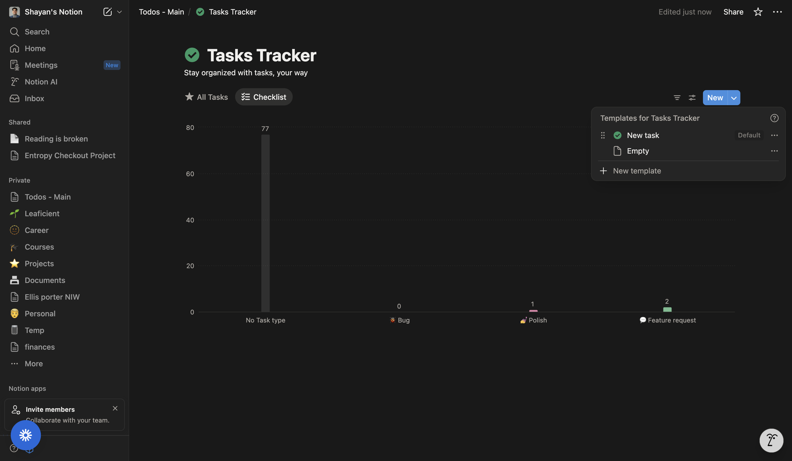

# Create a Chart View in Notion

Learn how to turn any Notion database view into a chart. This tutorial walks you through selecting an existing view, switching its layout to Chart, and configuring the chart so you can visualize your data clearly.

## What you’ll achieve
- Switch a database view’s layout to Chart
- Open the chart editor and settings
- Configure axes and aggregation to display the right insights

## Prerequisites
- A Notion database (e.g., Tasks, Projects) with at least a few entries
- Permission to edit views in the database

---

## Step 1: Open the view controls for your database

- In your database page, locate the view controls in the database header (above the list of entries).
- Click the view switcher or the current view’s name to access available views and options.
- You should see the database header update to show the selected view’s toolbar and settings.

Why: You’ll start by making sure you’re working from the correct view before changing its layout.

---

## Step 2: Switch to the “Checklist” view

- In the views area at the top of the database, click the tab labeled “Checklist.”
- The database content refreshes to show the “Checklist” view.

Why: We’ll convert this specific view to a chart so it retains its filters, sorts, and properties.

---

## Step 3: Open the view’s settings

- In the top-right of the database view header, click the gear icon labeled “Settings.”
- A menu with configuration options for the current view opens.

Why: The layout (List, Table, Board, Calendar, Timeline, Chart, etc.) is changed from the view’s settings.

---

## Step 4: Open the Layout menu

- In the settings menu, find the “Layout” option.
- Click the item that shows the current layout (it may display “Layout • List”).

What you should see: A submenu or panel indicating layout options for the current view.

---

## Step 5: Confirm the current layout and prepare to change it

- You’ll see “List” highlighted as the current layout.
- Stay in this Layout section; you’re about to switch to a different layout type.

Tip: This confirms you’re in the right place to change the view type.

---

## Step 6: Select the “Chart” layout

- In the layout options, click “Chart.”
- The view immediately switches to a chart layout with a placeholder chart or default configuration.

What you should see: A chart area appears where the database entries were previously listed.

---

## Step 7: Open the chart editor

- In the chart header, click the “Edit chart” button.
- The chart configuration panel opens, allowing you to choose chart type, axes, and aggregation.

Why: This is where you define how your data is visualized.

---

## Step 8: Access additional chart settings

- Click the gear icon labeled “Settings” in the chart area to open advanced options if available.
- Review options such as grouping, filters, and display preferences.

Tip: Use these settings to align the chart with your reporting needs.

---

## Step 9: Configure the chart and confirm

- Set the X-axis to the property you want to analyze (e.g., “Task type”).
- Choose an aggregation for the Y-axis (e.g., Count of tasks).
- Pick a chart type that best communicates the data (e.g., Bar or Column).
- Save or close the editor; your chart view should now display the configured visualization.

What you should see: A fully configured Chart view for your database reflecting your chosen properties and aggregation.

---

## Wrap-up

You’ve created a Chart view in Notion by switching a database view’s layout to Chart and configuring its axes and settings. You can return to the view’s settings at any time to adjust filters, groups, and chart options, or create additional views to compare different slices of your data.