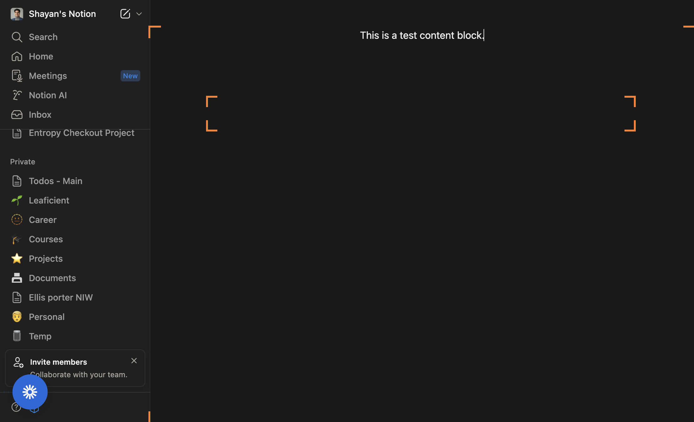

# How to Create a New Page in Notion

## Introduction
This tutorial shows, step‑by‑step, how to create a new page in Notion, add content, give the page a title, and verify the page is saved. Each step includes a screenshot and clear, actionable instructions describing which UI elements to interact with and what you should expect to see.

---

## Step 1 — Open a new page

What to do
- In the left sidebar of your Notion workspace, click the **New page** button (the button labeled "New page" or the plus/new page control near the bottom of the sidebar).
- This opens a blank page in the main content area.

Why this step matters
- Clicking **New page** creates a fresh workspace where you can add a title and content.
- Expectation / visual cues:
  - A blank page appears in the center of the screen.
  - You should see an empty title field at the top and an empty content area below it.
  - The new page will be highlighted in the sidebar while it’s open.

Tips
- If you don’t see the **New page** button, expand the sidebar or look for a plus (+) icon next to your workspace or a page section.

---

## Step 2 — Add content to the page

What to do
- Click into the main content area below the title and type your content. In this example, type:
  - This is a test content block.
- Press Enter to create new blocks and continue adding text or other block types (To‑Do, Heading, Bullet list, etc.).

Why this step matters
- Adding content populates the page and demonstrates how blocks work in Notion.
- Expectation / visual cues:
  - The text you type appears as a paragraph block in the page body.
  - A cursor will show where you are typing; pressing Enter creates a new block line.
  - Notion will show the block toolbar (small handle to the left) when you hover over the block.

Tips
- Use "/" to open the block menu and insert different block types (e.g., /heading, /todo).
- Notion autosaves your content as you type.

---

## Step 3 — Name (title) the page

What to do
- Click the title area at the top of the page and type a descriptive page title (for example, "Test Page").
- This action is recorded here as an "other action" — giving the page a name helps you find it later.

Why this step matters
- A proper page title makes the page easy to identify in the sidebar and search results.
- Expectation / visual cues:
  - The title text appears at the very top of the page, larger than the body text.
  - The page’s URL may update to reflect the title (you’ll see the title text in the page address).
  - The page entry in the sidebar will show the new title once it’s set.

Tips
- Titles can include emojis or icons — click the icon area to add or change it.
- If you rename the page, the content remains intact; Notion will autosave the change.

---

## Step 4 — Confirm the page is saved and accessible

What to do
- Verify the page has been created and saved. Look for the page name in the sidebar or use the search box (at the top left) to find it.
- This final recorded step is noted as "Task completed successfully" — meaning the page creation process is finished.

Why this step matters
- Ensuring the page is saved and visible confirms your work won’t be lost and that the page can be reopened later.
- Expectation / visual cues:
  - The new page appears in the left sidebar under your workspace or in the location you created it.
  - Changes are autosaved; you should not need to manually save.
  - You can close and reopen the page from the sidebar and find your typed content present.

Tips
- If you want to move the page into a specific workspace or parent page, use the "Move to" option from the page menu (click the ••• menu at the top right of the page).
- Add a cover, icon, or properties (for databases) to better organize and identify the page.

---

## Summary
You have now:
1. Created a new page using the **New page** button in the sidebar.
2. Added content in the page body.
3. Given the page a meaningful title.
4. Confirmed the page was saved and is accessible in your workspace.

Next steps you might try
- Add more blocks (tables, images, embeds) using the "/" command.
- Organize the page by moving it into a parent page or a database.
- Share the page or adjust permissions with the Share menu at the top right.

If anything looks different than described, check that you are in the correct Notion workspace and that your sidebar is expanded so the **New page** button and created pages are visible.