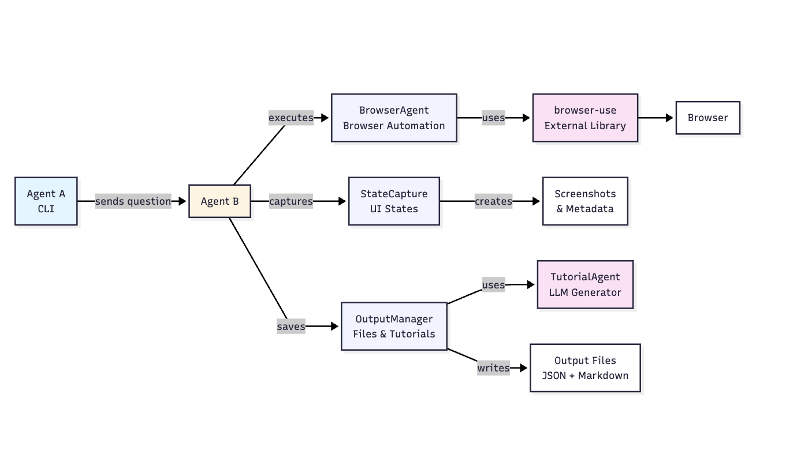

# Agentic Browsing

A multi-agent system for capturing UI states during browser automation tasks. Agent A spawns Agent B to execute tasks and automatically capture screenshots of each UI state in the workflow.

## Overview

This system demonstrates how to:
- Automatically navigate live web applications
- Capture UI states (including modals, forms, and other non-URL states)
- Generate step-by-step tutorials with screenshots
- Handle any kind of task across different web apps

## Project Structure

```
agent_a/
  agent_a.py          # Entry point that spawns Agent B
  
agent_b/
  browser_agent.py    # Wraps browser-use Agent
  state_capture.py    # Captures UI states and builds Step objects
  task_runner.py      # Orchestrates task execution
  output_manager.py   # Manages output files (JSON, tutorials)
  tutorial_agent.py    # Generates markdown tutorials using LLM

examples/
  incognito_ai_job_search.py  # Example script using browser-use directly
```

## Setup

### 1. Environment Setup

Create a conda environment:

```bash
conda activate agentic-browsing
```

### 2. Environment Variables

Create a `.env` file in the project root with your API keys:

```bash
OPENAI_API_KEY=your_openai_api_key_here
BROWSER_USE_API_KEY=your_browser_use_api_key_here
```

### 3. Dependencies

All dependencies are managed through the conda environment. See `environment-agentic-browsing.yml` for the full list.

## Usage

### Running Agent A (which spawns Agent B)

Agent A is the CLI entry point that receives task instructions and spawns Agent B to execute them.

**Basic usage:**

```bash
python -m agent_a.agent_a --task "How can I create a new page in Notion?"
```

**With browser selection:**

```bash
python -m agent_a.agent_a --task "How do I filter a database in Notion?" --browser chrome
```

**Available browsers:**
- `arc` (default)
- `chrome`
- `chromium`
- `safari`

### Command Line Options

```bash
python -m agent_a.agent_a --help
```

Options:
- `--task`, `-t`: Natural language task description (required)
- `--browser`, `-b`: Browser to use (default: arc)

### Examples

```bash
# Create a new page in Notion
python -m agent_a.agent_a --task "How can I create a new page in Notion?"

# Find a specific page
python -m agent_a.agent_a --task "how can I find my socks page in Notion?"

```

## Architecture


