# How to how can i create a notion database

**Status:** success
**Total Steps:** 16

---

## Instructions

Follow these steps to complete the task:

### Step 2

Click on the 'New Database' button located in the left sidebar to initiate the creation of your database.

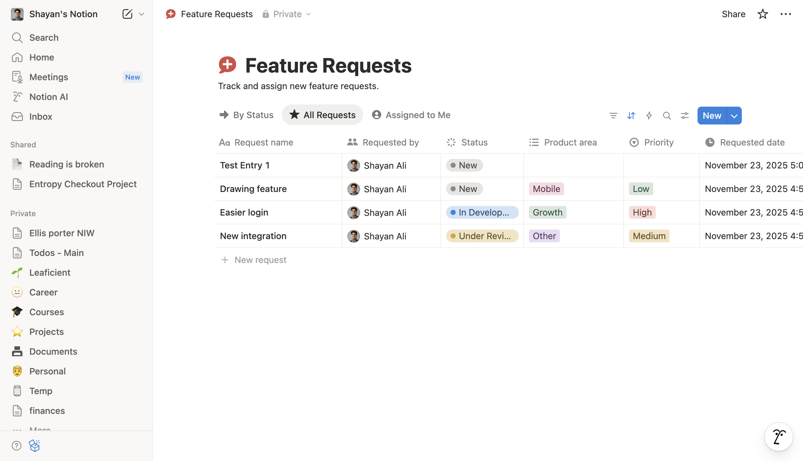

*You should see a new dialog box prompting you to choose a database type, indicating that you're now one step closer to creating your database.*

---

### Step 3

Click on the button labeled 'New page' located at the top right of the Notion interface to initiate the creation of a new database.

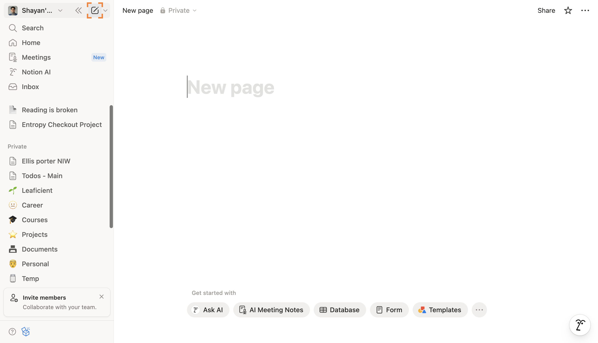

*You should see a blank database page with column headers, indicating that you're now one step closer to creating your database.*

---

### Step 4

Click on the 'Database' option in the menu that appears after creating a new page to initiate the process of setting up your database.

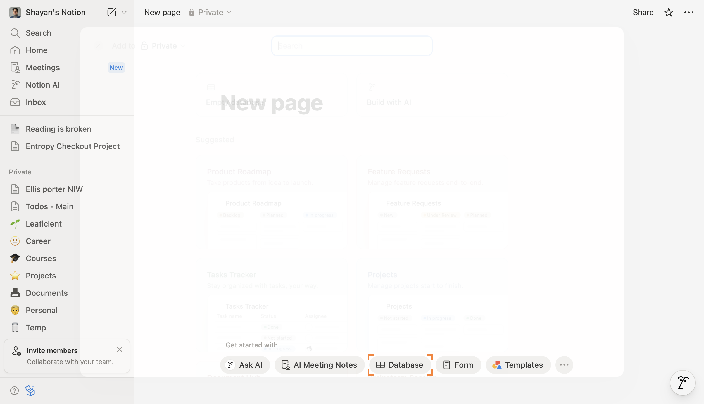

*You should see a new database interface with options to add columns and customize your database layout, bringing you closer to creating your database.*

---

### Step 5

Now that you've selected 'Database', click on 'Empty database' to create a blank database that you can customize.

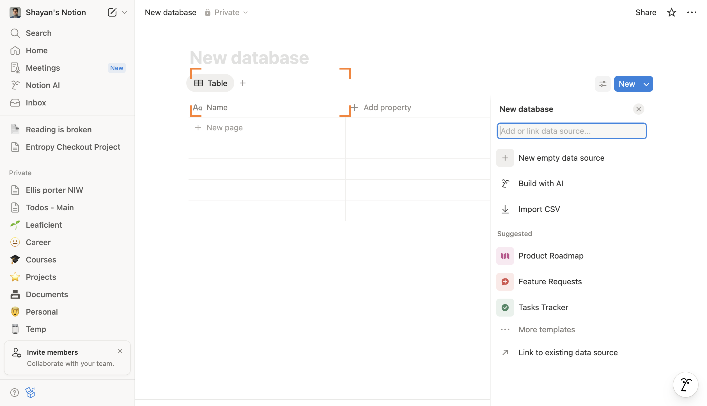

*You should see a new blank database page with column headers ready for you to add your data, bringing you one step closer to creating your database.*

---

### Step 6

Click on the 'Add property' button located at the top of the database interface to include new fields in your database, which will allow you to customize the information you want to track.

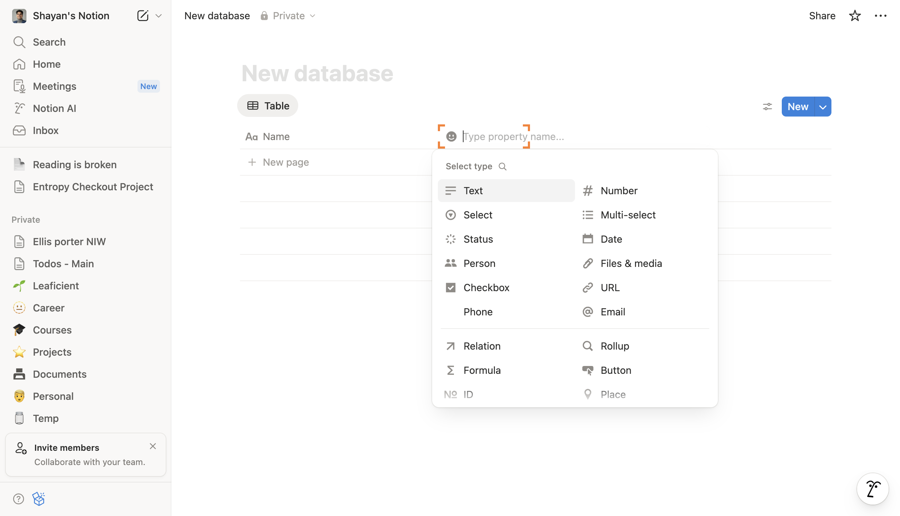

*You should see a dropdown menu appear, allowing you to select different property types for your database, bringing you closer to fully setting up your database.*

---

### Step 7

Click on the 'Date' property option in the property settings panel to add a date field to your database, which will allow you to track dates for your entries.

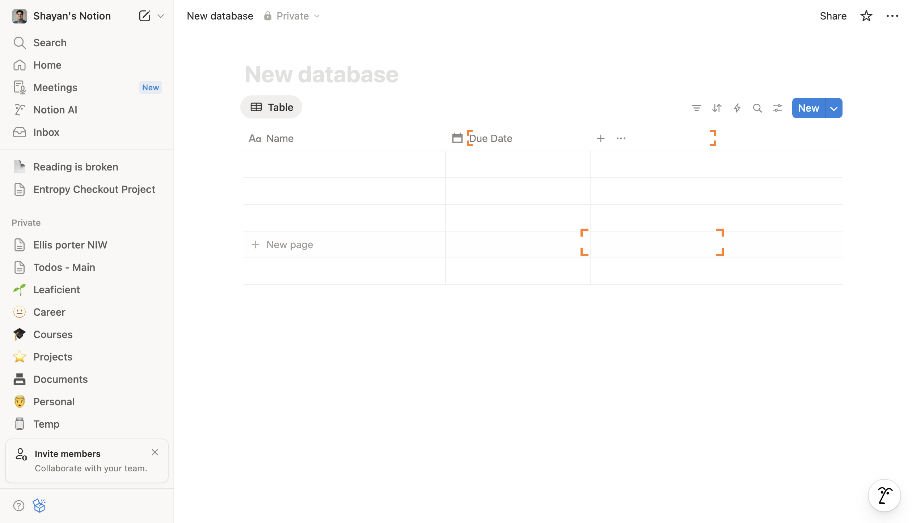

*You're now one step closer to creating your database, and you should see the 'Date' field added to your database properties in the panel.*

---

### Step 8

Click on the button labeled 'Add View' located at the top right of the database interface to create a new view for your database.

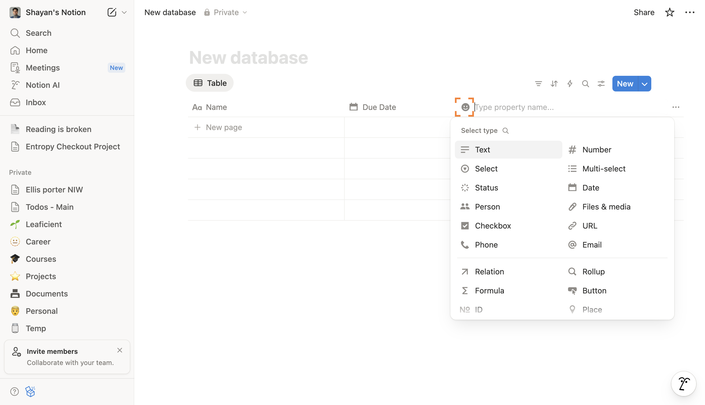

*You should see a dropdown menu with options to customize your new view, bringing you closer to organizing your database effectively.*

---

### Step 9

Click on the 'Number' option in the property type menu to add a numerical property to your database, which will allow you to track numerical values within your entries.

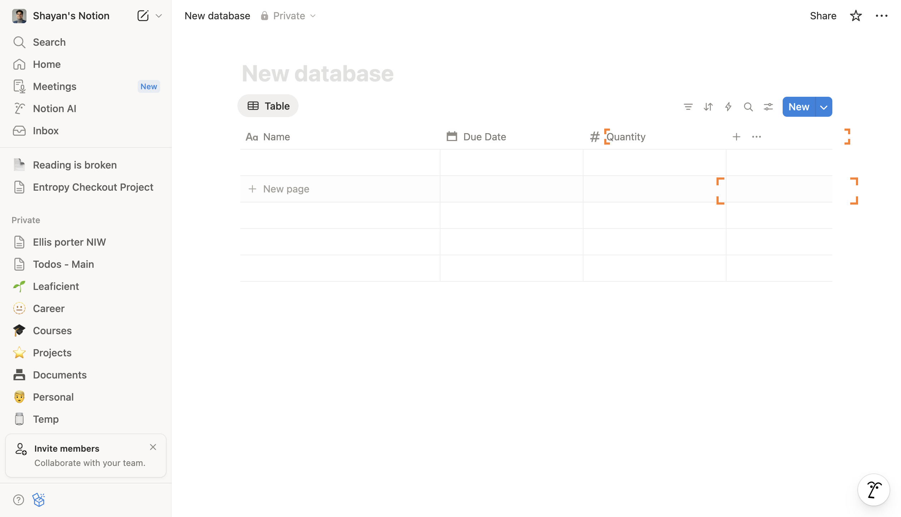

*You should see the property type change to 'Number', indicating that you can now input numerical data into this column of your database.*

---

### Step 10

Click on the 'New page' button located in the top right corner of the Notion interface to create a new database entry.

*You should see a new blank page open, ready for you to start building your database, bringing you one step closer to completing your database setup.*

---

### Step 11

In the text field labeled 'Name', type 'Sample Item' to create a new entry in your database.

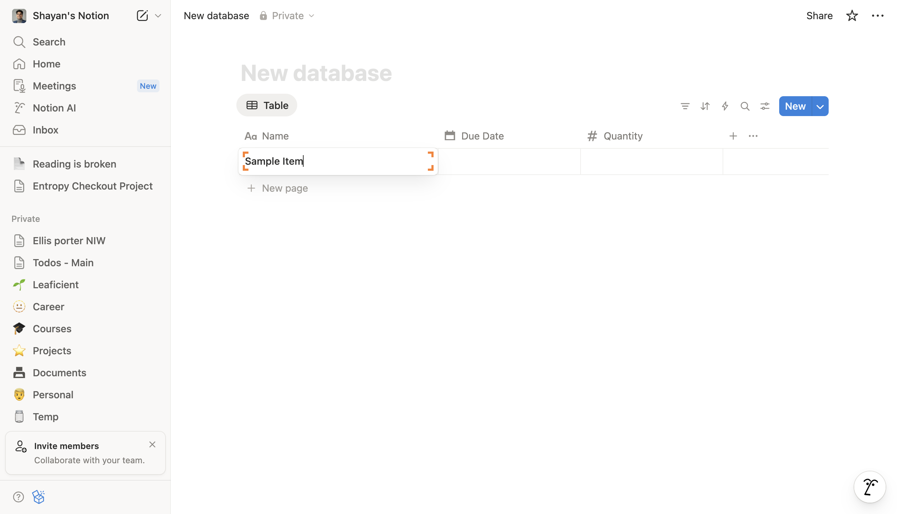

*You should see 'Sample Item' appear in the database, indicating that you've successfully added a new item to your database.*

---

### Step 12

Click on the button labeled 'Done' at the bottom right of the database setup panel to finalize your property settings, which will save your changes and prepare your database for use.

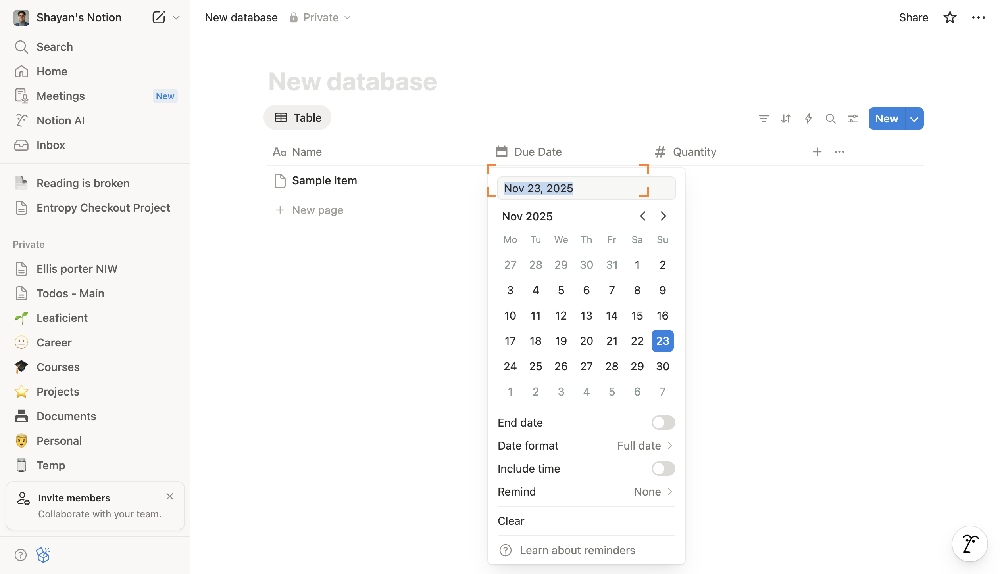

*You should see the updated database interface with your newly added properties displayed as column headers, indicating you're now one step closer to creating your database.*

---

### Step 13

Click on the text labeled '23' in the database to select this specific entry, which will allow you to view or edit its details.

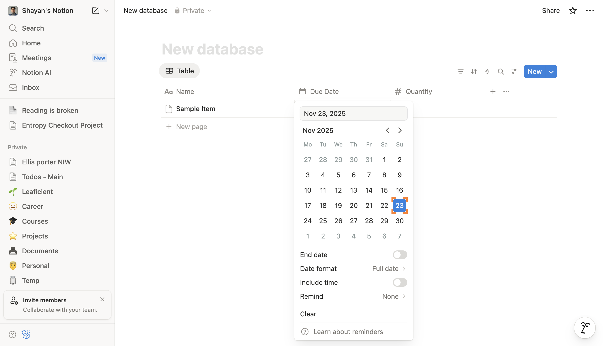

*You should now see the details of the entry '23' displayed on the right side of the screen, bringing you closer to managing your database effectively.*

---

### Step 14

Click on the button labeled 'Save' at the bottom right of the page to finalize your changes and create the database.

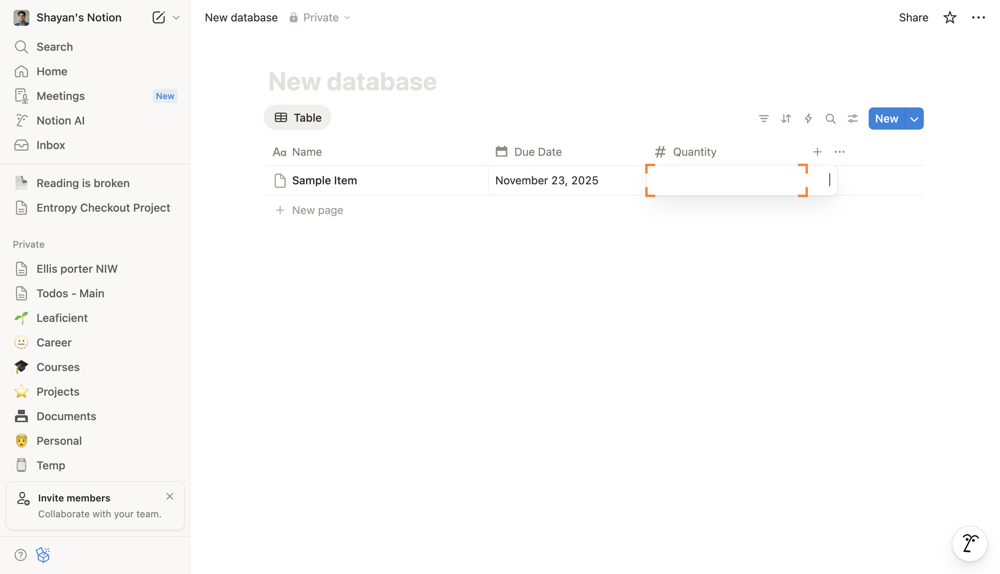

*You should see a confirmation message indicating that your database has been successfully created, bringing you one step closer to managing your data.*

---

### Step 15

In the text field labeled 'Number', type '10' to enter a numeric value for your database entry, which will help define the data you are adding.

*You should see the number '10' appear in the 'Number' field, indicating that the value has been successfully entered and you're now one step closer to completing your database entry.*

---

### Step 16

Click on the 'Done' button at the bottom right of the screen to finalize your entry, which will save the changes you made to the database item.

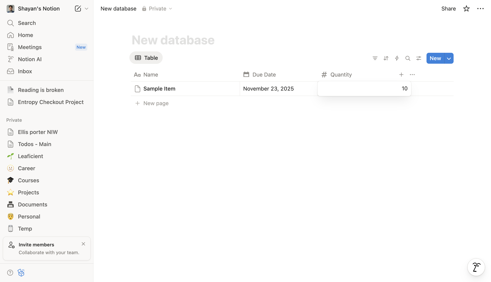

*You should see a confirmation message indicating that your changes have been saved, bringing you one step closer to successfully creating your database.*

---
