# How to how can i create a notion database

**Status:** timeout
**Total Steps:** 20

---

## Instructions

Follow these steps to complete the task:

### Step 2

Click on the 'Log in' button located at the top right corner of the Notion homepage to access your account, which will allow you to create your database.

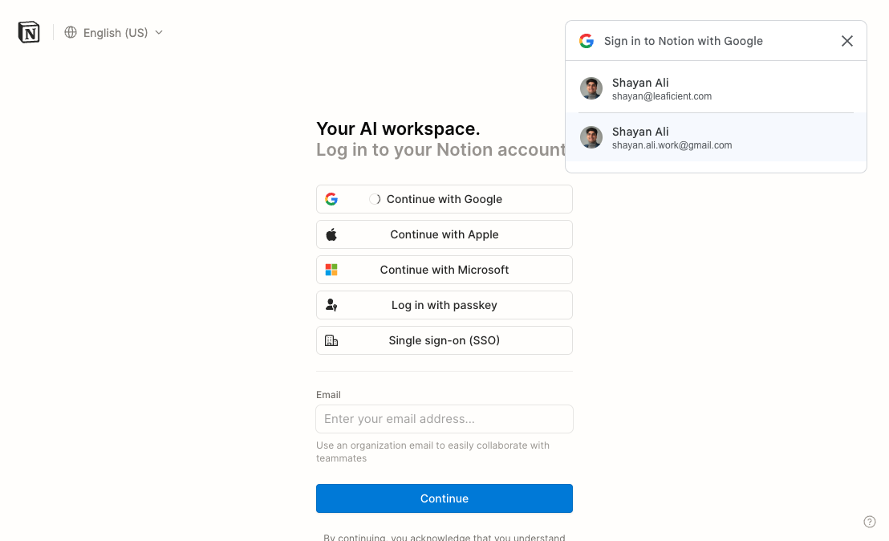

*You should see a login dialog box prompting you to enter your email and password, bringing you one step closer to accessing your Notion workspace.*

---

### Step 3

Click on the 'Log In' button located at the top right corner of the Notion homepage to access your account and proceed with creating your database.

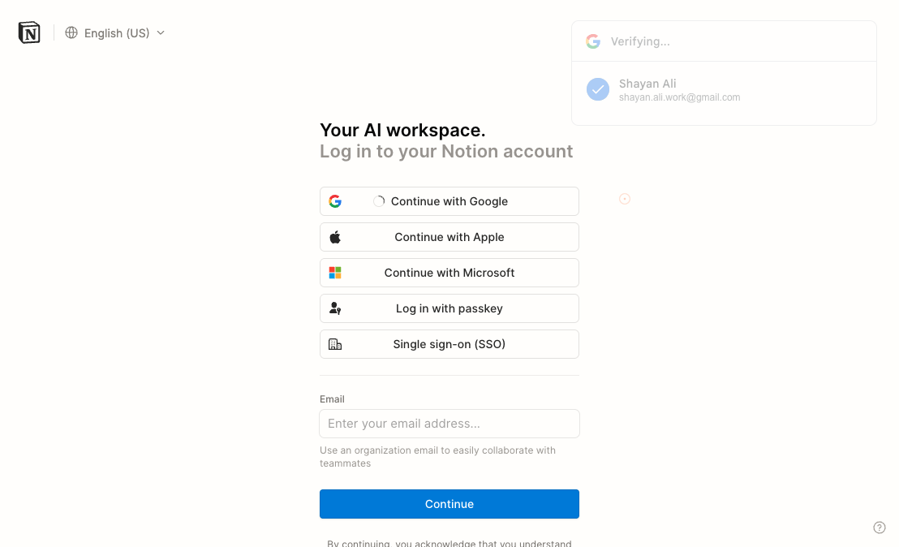

*You should see the login interface where you can enter your email and password, bringing you closer to accessing your workspace.*

---

### Step 4

Click on the 'New Database' button located in the left sidebar to initiate the creation of your database.

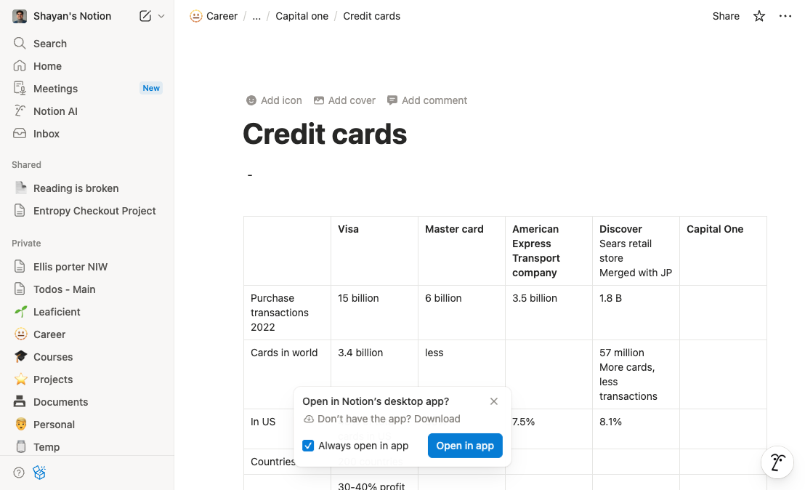

*You should see a new dialog box prompting you to choose a database type, bringing you one step closer to setting up your database.*

---

### Step 5

Click on the button labeled 'Dismiss' that appears in the dialog box to close it, which will allow you to proceed with creating your database without distractions.

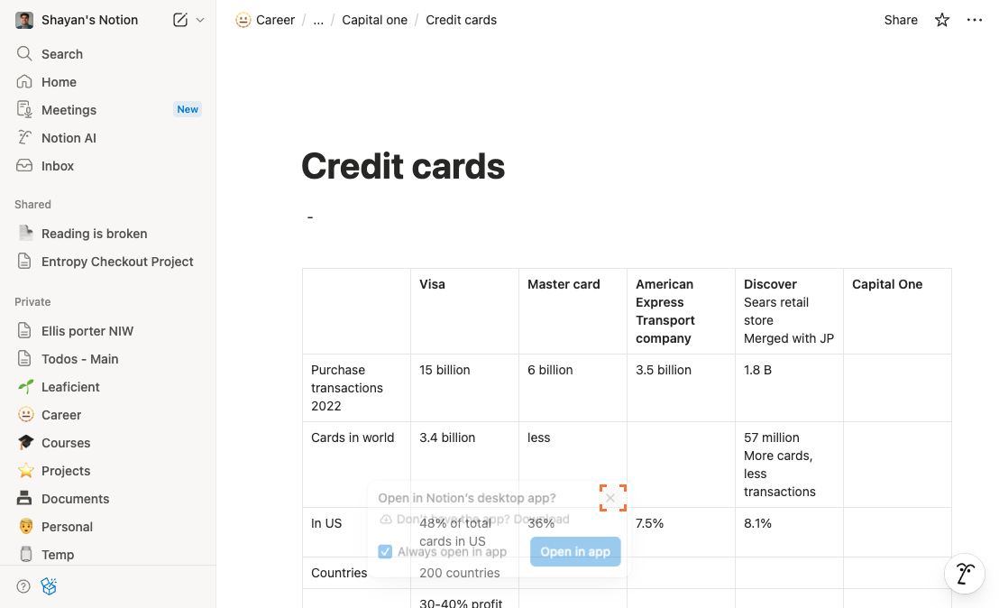

*You should see the dialog box disappear, bringing you back to the main Notion interface, and you're now one step closer to creating your database.*

---

### Step 6

Click on the button labeled 'New page' located in the top right corner of the Notion interface to initiate the creation of a new database.

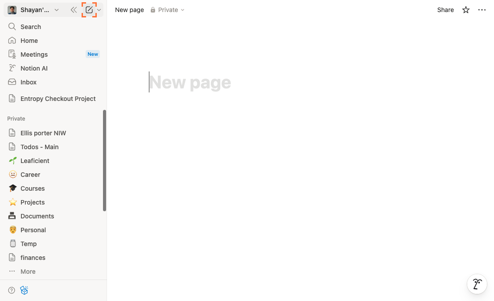

*You should see a blank page with options to customize your new database, bringing you one step closer to setting it up.*

---

### Step 7

Click on the 'Database' option in the dropdown menu that appears after selecting 'New page' to create a new database structure.

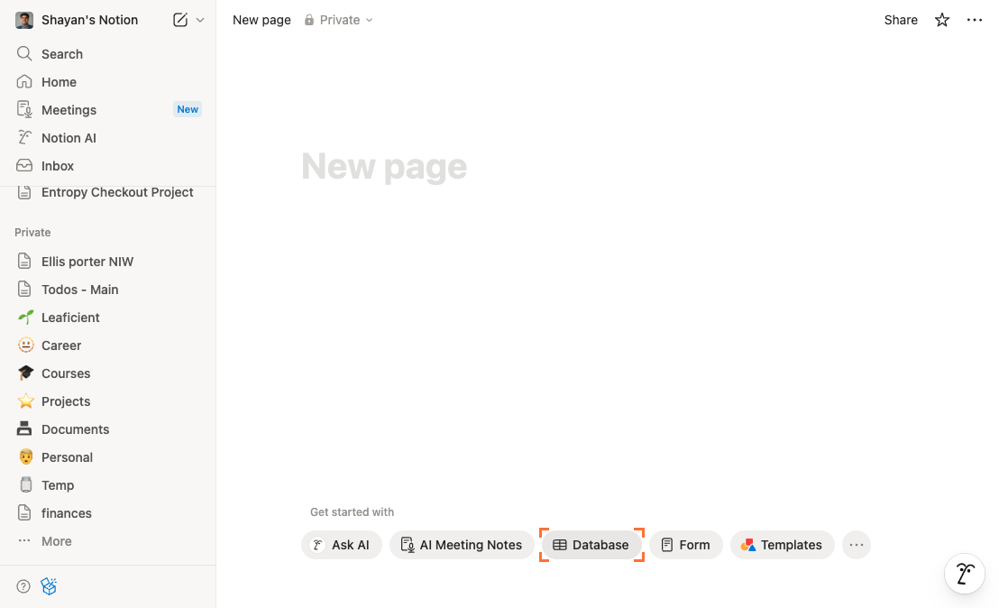

*You should see a new database interface with options to add columns and customize your database, bringing you one step closer to organizing your information.*

---

### Step 8

Click on 'Empty database' in the template options to create a blank database, which will allow you to start organizing your information from scratch.

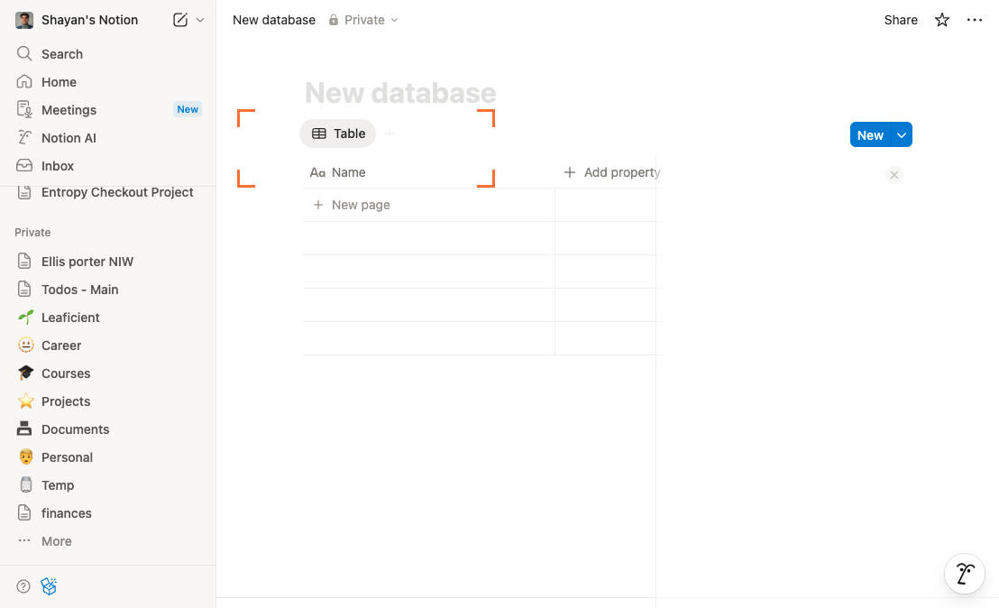

*You're now one step closer to creating your database, and you should see a blank database page with column headers ready for you to customize.*

---

### Step 9

In the text field labeled 'Name', type 'Task Tracker' to designate the name of your new database, which will help you identify its purpose later.

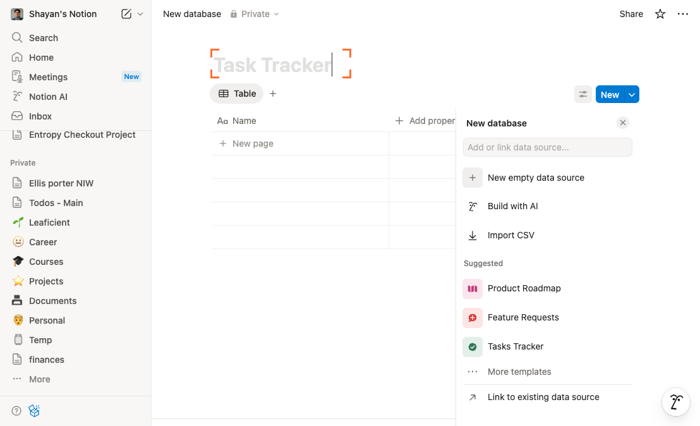

*You should see the name 'Task Tracker' appear in the database title area, indicating that you've successfully named your database and are one step closer to completing the setup.*

---

### Step 10

Click on the 'Add property' button located at the top of the database interface to include a new property in your database, which will allow you to customize the data structure for your tasks.

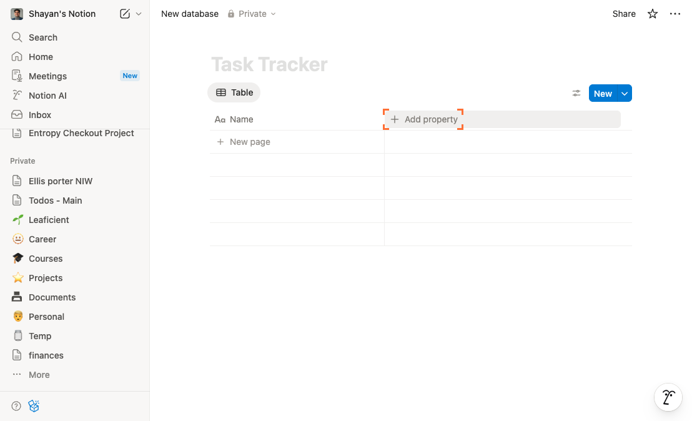

*You should see a new property field appear, allowing you to define the type and name of the property, bringing you closer to fully setting up your database.*

---

### Step 11

Now that you've added a property, click on the 'Status' option in the property type dropdown menu to define the status of your tasks.

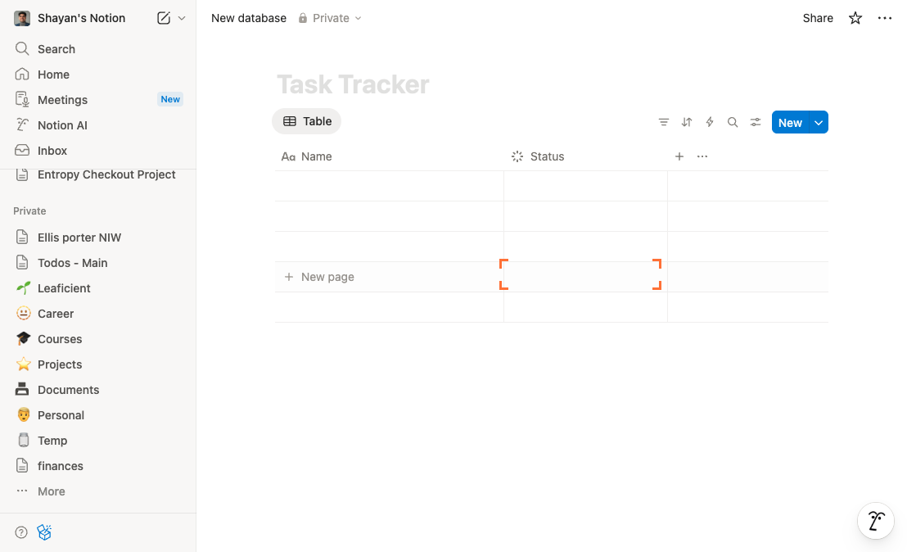

*You should see a list of status options appear, allowing you to categorize your tasks, bringing you closer to completing your database setup.*

---

### Step 12

Click on the 'Status' property in the properties panel to configure the status options for your tasks.

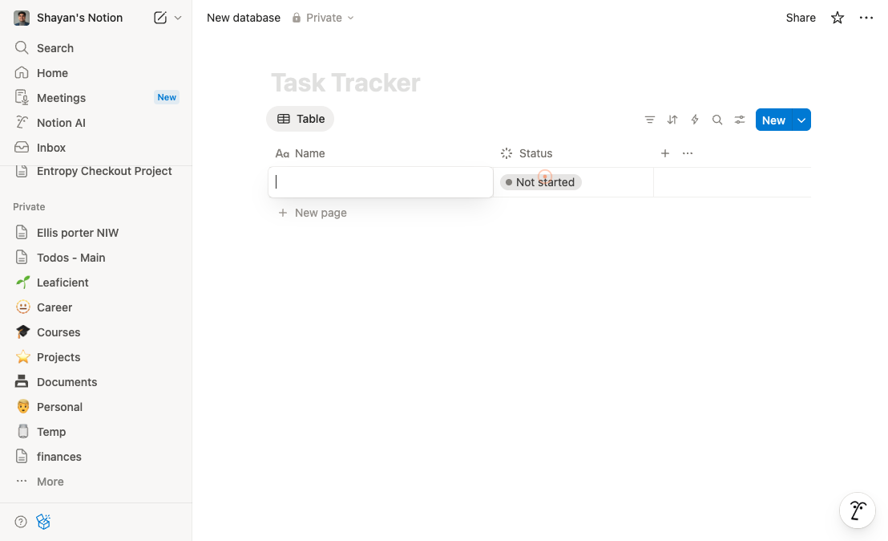

*You should see a settings menu appear on the right side of the screen, allowing you to customize the status options for your database, bringing you closer to fully setting up your Task Tracker.*

---

### Step 13

Click on the button labeled 'Add property' in the database interface to include a new property for your tasks.

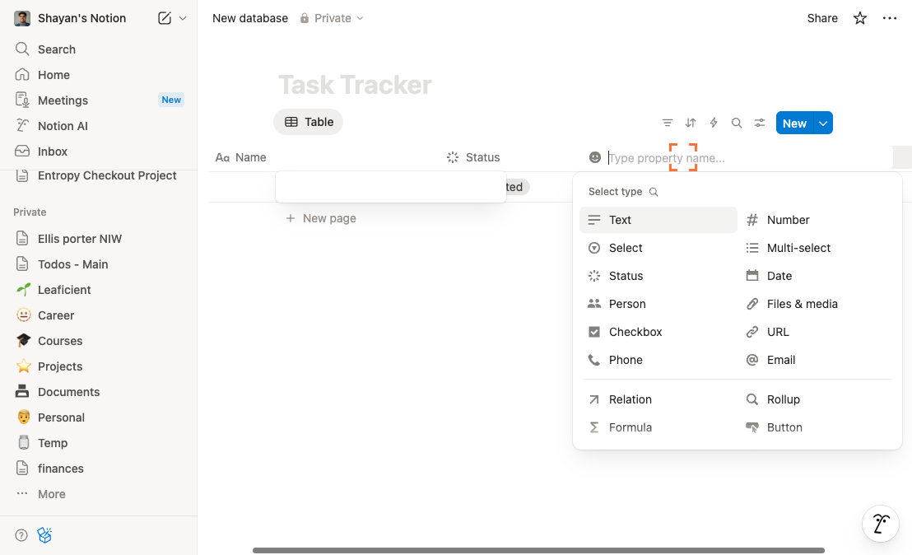

*You should see a new property field appear in the database where you can define the type and name of the property, bringing you closer to customizing your database.*

---

### Step 14

Click on the 'Date' property option in the dropdown menu that appears after adding a new property, in order to specify that this column will track dates for your tasks.

*You should see a new date column added to your database, allowing you to input and manage due dates for each task, bringing you closer to fully setting up your Task Tracker.*

---

### Step 15

Click on the 'Date' property option in the property settings menu to add a date column to your database, which will allow you to track deadlines and schedules for your tasks.

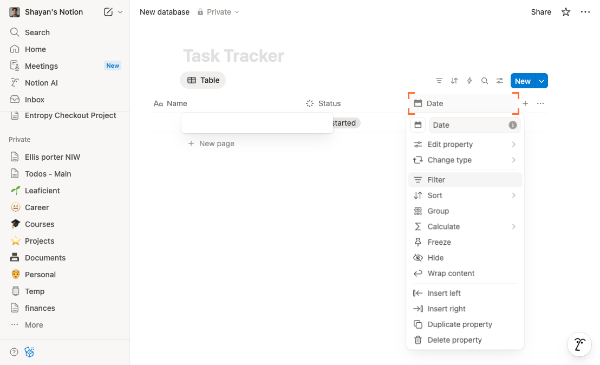

*You should see the 'Date' property added to your database with a new column header, bringing you closer to completing your task tracker setup.*

---

### Step 16

In the text field labeled 'Property Name', type 'Due Date' to create a new property for tracking deadlines in your database.

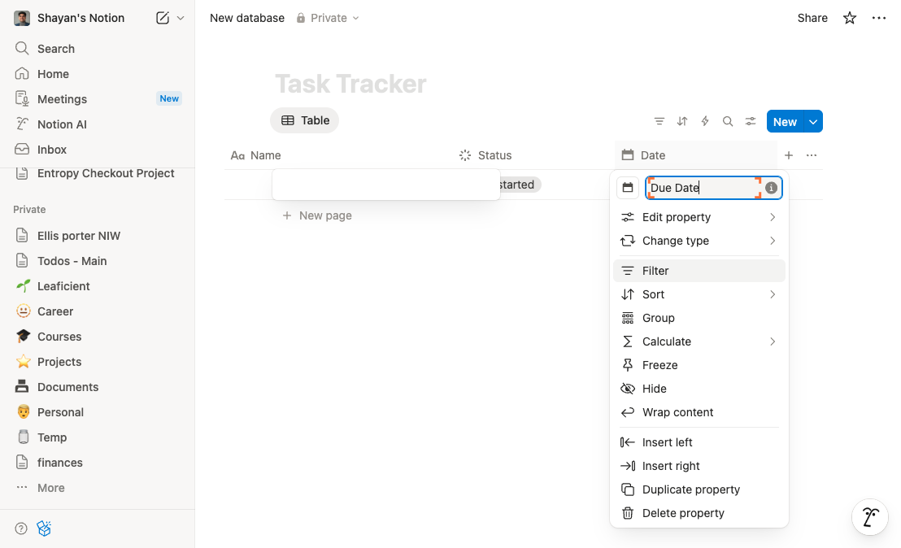

*You should see 'Due Date' appear as the new property name, indicating that you are now one step closer to organizing your tasks with specific due dates.*

---

### Step 17

Click on the button labeled 'Add Property' located in the database settings menu to include a new field in your database, which will allow you to customize the information you want to track.

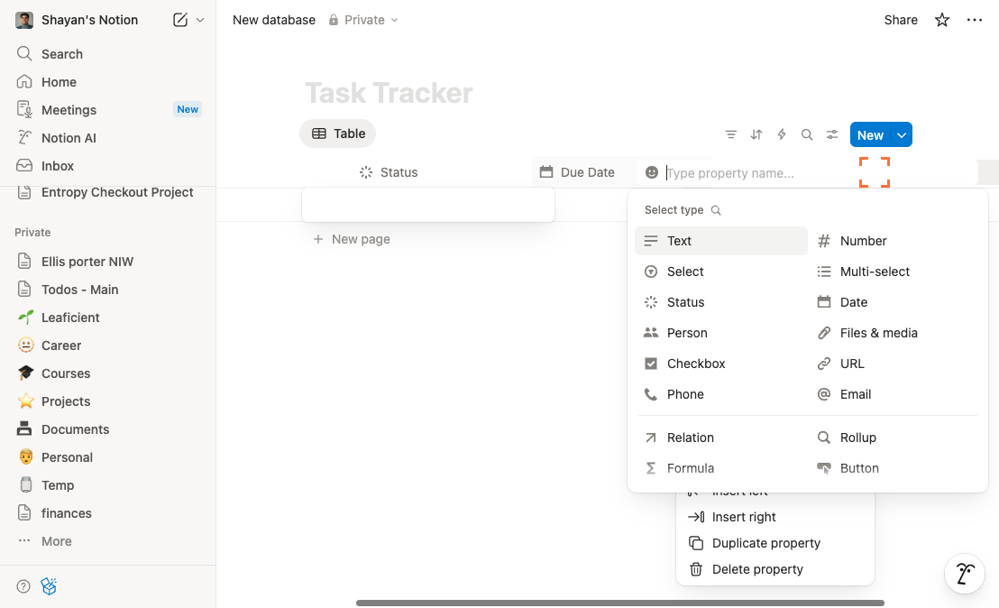

*You should see a new property field appear in the database settings, indicating that you are now one step closer to tailoring your database to your needs.*

---

### Step 18

Click on the 'Select' button in the dropdown menu that appears after you clicked on 'Status' to choose the status options for your database entries.

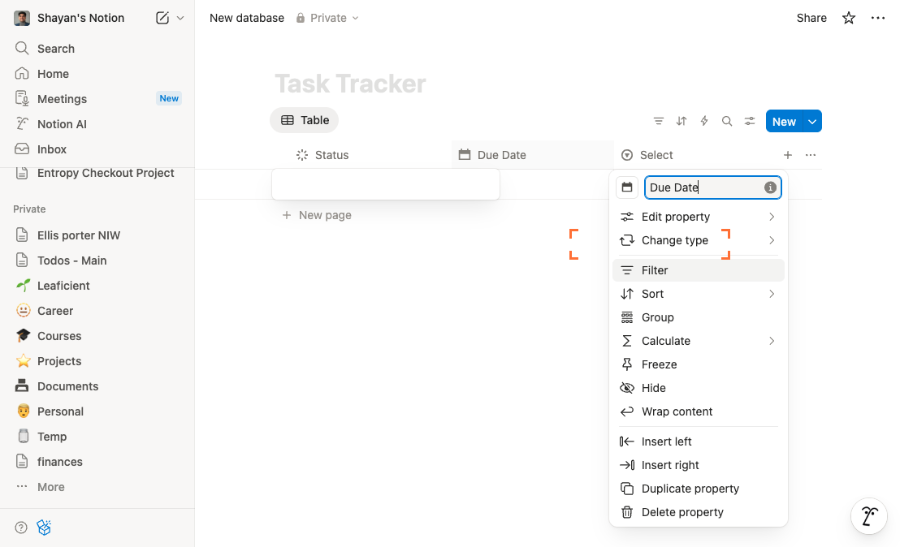

*You should see a list of available status options appear, allowing you to customize the status field for your database, bringing you closer to completing your database setup.*

---

### Step 19

Click on the 'Select' option in the dropdown menu that appears to choose the type of property for your database, which will allow you to define how you want to categorize your entries.

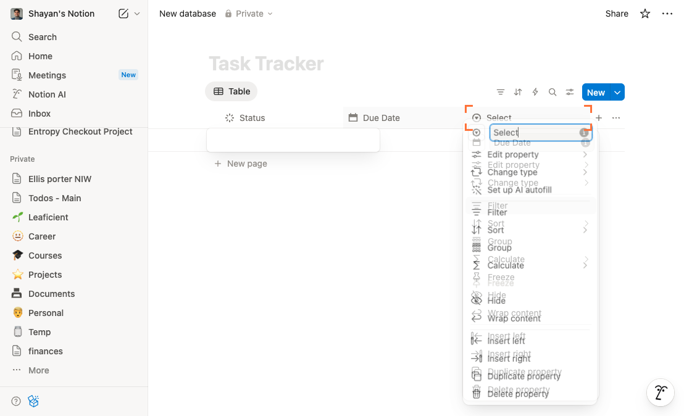

*You're now one step closer to creating your database, and you should see a list of property types available for selection.*

---

### Step 20

In the text field labeled 'Property Name', type 'Priority' to create a new property in your database that will help categorize tasks based on their urgency.

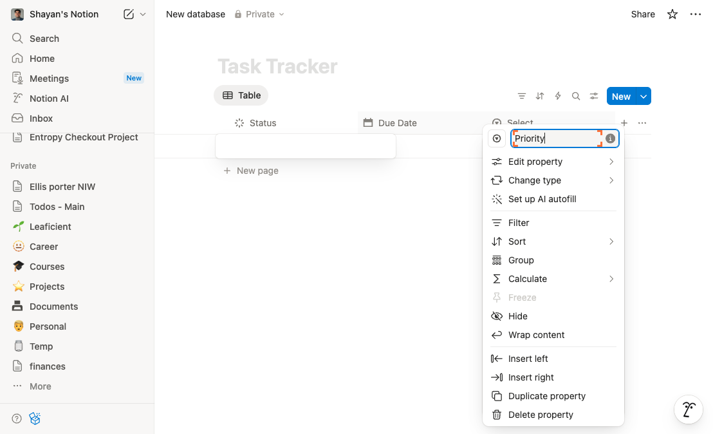

*You should see 'Priority' appear as a new property in your database, indicating that you are now one step closer to organizing your tasks effectively.*

---
