# How to how can i find my most recently created page in notion

**Status:** timeout
**Total Steps:** 19

---

## Instructions

Follow these steps to complete the task:

### Step 2

Click on the 'Recent Pages' link located in the sidebar to view a list of your most recently created pages, which will help you quickly access your latest work.

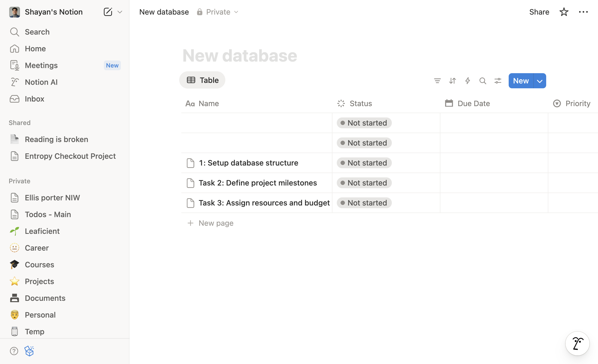

*You should see a list of pages displayed on the right side of the screen, with the most recently created page at the top, bringing you closer to locating your latest content.*

---

### Step 3

Click on the 'Search' option located at the top left of the Notion interface to begin finding your most recently created page.

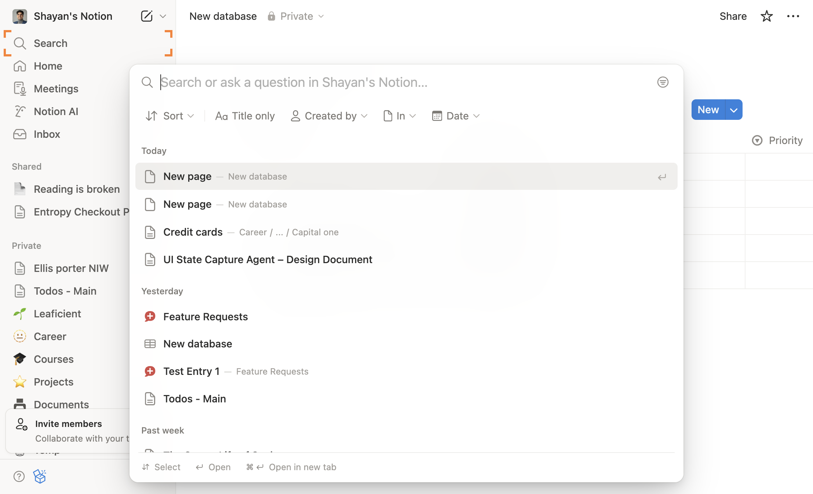

*You should see a search bar appear at the top of the page, allowing you to enter keywords to locate your recent pages.*

---

### Step 4

Click on the 'Recent' option in the sidebar to view your most recently created pages, which will help you quickly locate the page you just created.

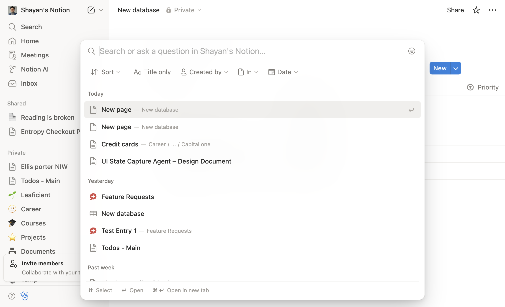

*You should see a list of your recent pages displayed in the main area, allowing you to identify your most recently created page easily.*

---

### Step 5

Click on the page title at the top of the page to open your most recently created page, which will allow you to view and edit its content.

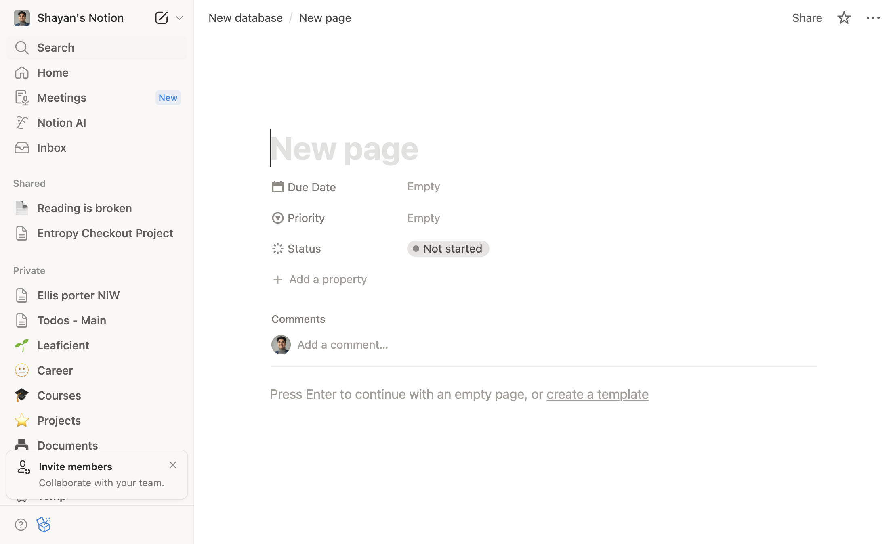

*You should see the content of your most recently created page displayed, with the page title prominently at the top and editing options available.*

---

### Step 6

Click on the 'Search' option located at the top left of the Notion interface to initiate a search for your most recently created page.

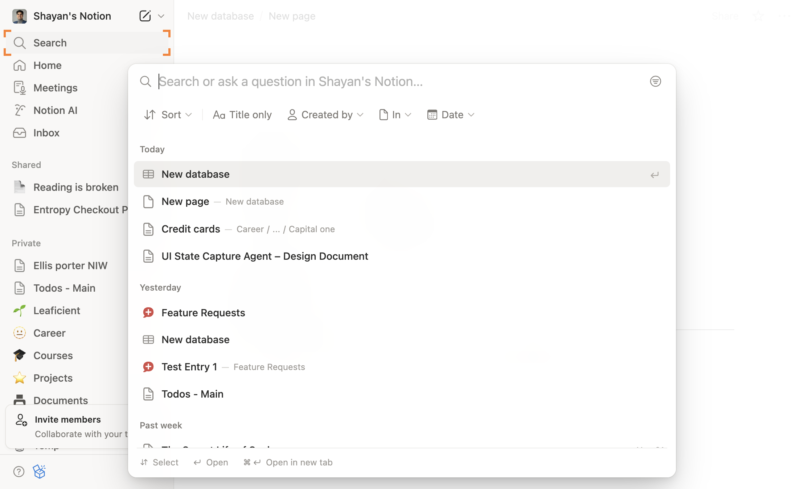

*You should see a search bar appear at the top of the page, allowing you to enter keywords related to your recently created page.*

---

### Step 7

Type the letter 'a' in the search field at the top of the page to filter your results, which will help you quickly locate your most recently created page that starts with this letter.

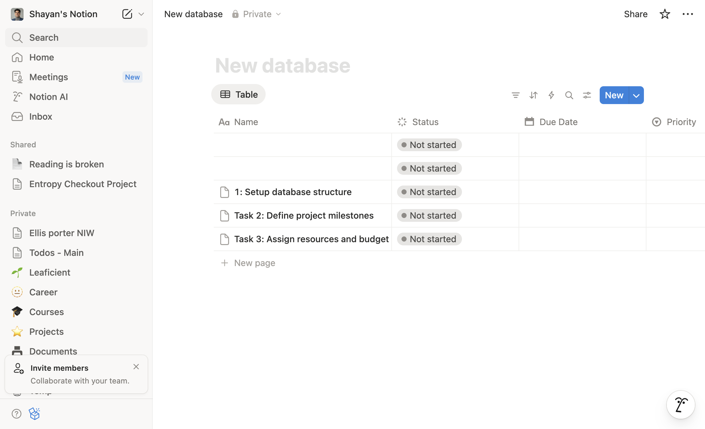

*You should see a list of pages that match your search criteria, narrowing down your options and bringing you closer to finding your most recently created page.*

---

### Step 8

Click the back button in your web browser to return to the previous page, which will help you navigate back to the search results you were viewing.

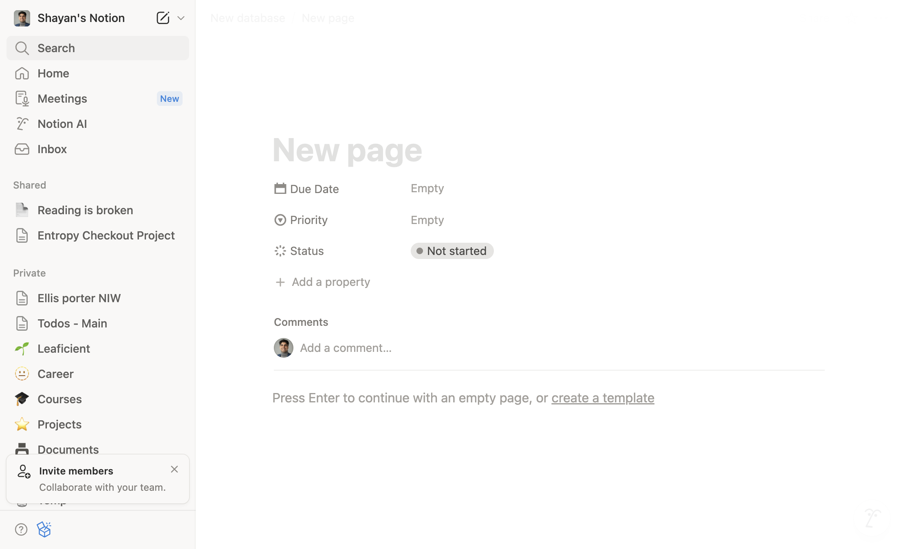

*You should see the search results page reappear, displaying a list of pages that match your search criteria, bringing you closer to finding your most recently created page.*

---

### Step 9

Click on the 'Search' option located in the top left corner of the Notion interface to initiate a search for your recently created pages.

*You should see a search bar appear at the top of the page, allowing you to enter keywords to find your most recent page.*

---

### Step 10

In the search field at the top of the Notion interface, type the letter 'a' to filter your pages and find your most recently created content.

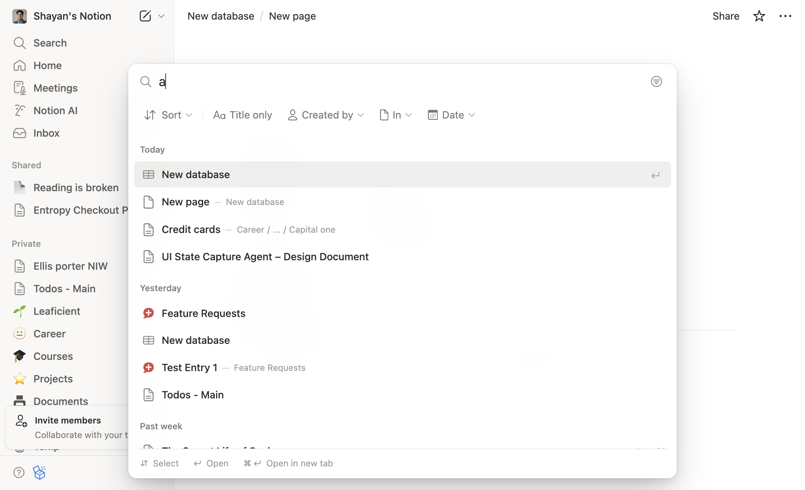

*You should see a list of pages that include the letter 'a' in their titles, helping you identify your most recent page more easily.*

---

### Step 11

Click on the 'Recent' tab in the sidebar to view your most recently created pages, which will help you quickly locate the page you just created.

*You should see a list of your recent pages displayed, with the most recently created page at the top of the list, bringing you closer to accessing your latest work.*

---

### Step 12

Click on the 'Sort' option located in the dropdown menu at the top of the page to organize your search results by the most recent pages, which will help you quickly find your latest creations.

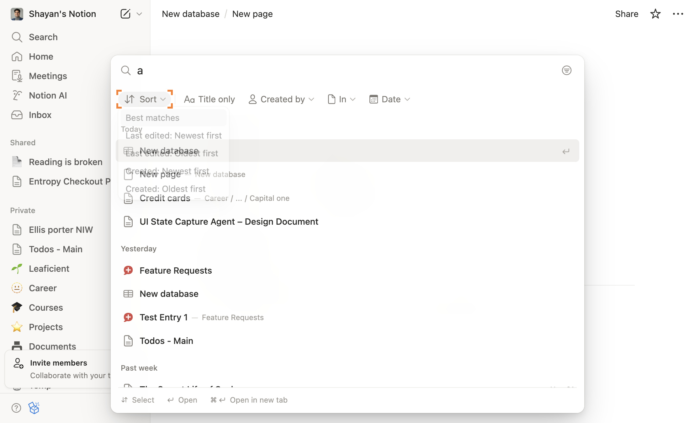

*You should see a sorted list of pages with the most recently created ones appearing at the top, bringing you closer to locating your latest Notion page.*

---

### Step 13

Click on the option labeled 'Created: Newest first' in the dropdown menu that appears after clicking 'Sort' to arrange your pages by their creation date, which will help you quickly find the most recently created page.

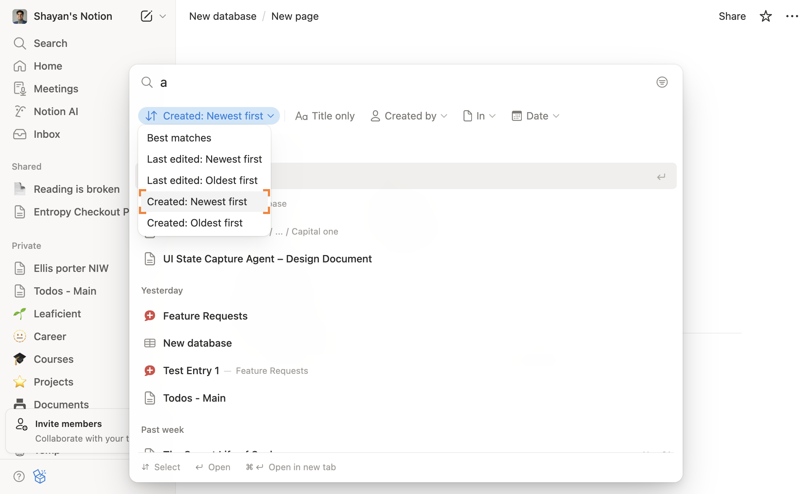

*You should see your pages rearranged in descending order based on their creation date, making it easier to locate the latest page you created.*

---

### Step 14

Click on the 'In' option located in the sorting dropdown menu to filter your search results by the most recent pages created.

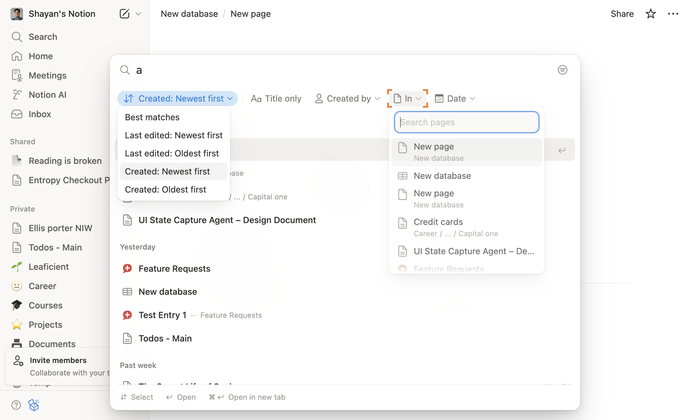

*You should see the list of pages now sorted, with your most recently created page appearing at the top of the list, bringing you closer to locating it.*

---

### Step 15

Click on the 'Execute' button located in the action menu to finalize your search and display your most recently created page in Notion.

*You should see your most recently created page highlighted at the top of the search results, allowing you to access it directly.*

---

### Step 16

Click on the option labeled 'In' in the dropdown menu that appears after sorting, in order to filter your search results by the specific workspace or page where your recently created content is located.

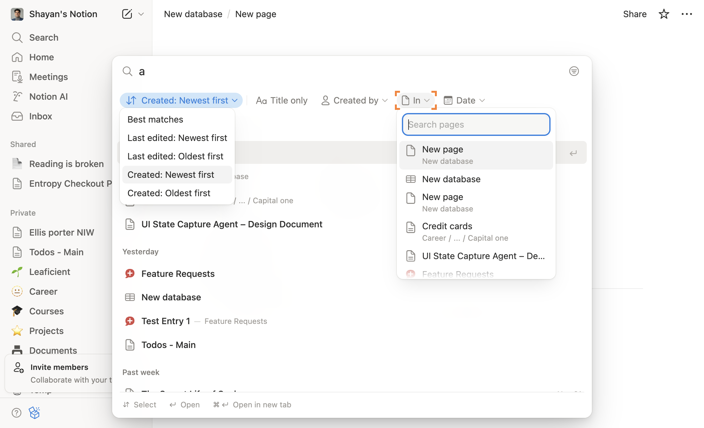

*You should see a list of pages or workspaces that match your filter criteria, bringing you closer to locating your most recently created page.*

---

### Step 17

Click on the 'Created by' option in the sorting dropdown menu to organize your pages by the creator, which will help you identify your most recently created page more easily.

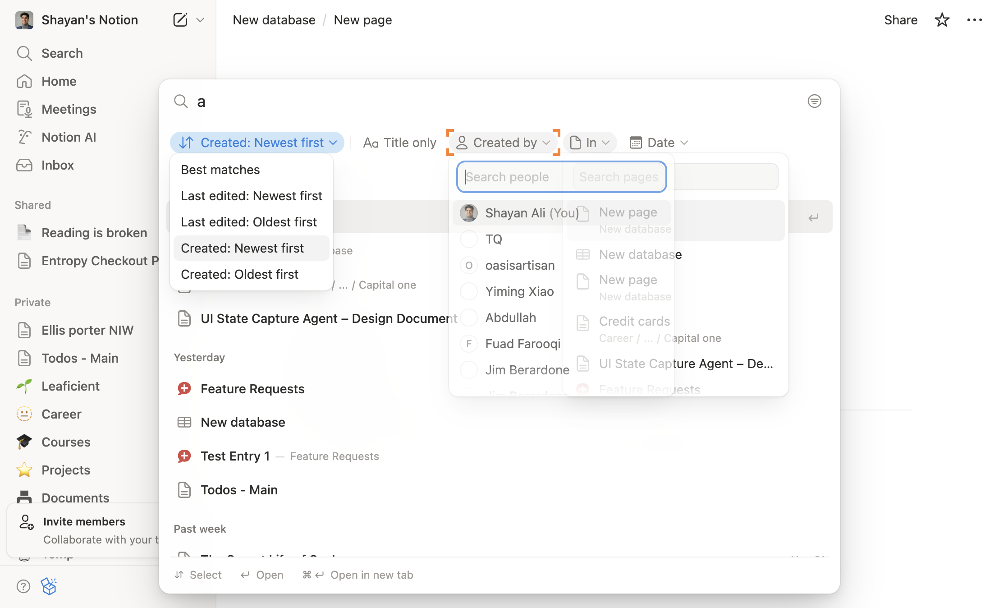

*You should see the pages rearranged in the main view, now sorted by the creator, making it simpler to locate your latest entries.*

---

### Step 18

Click on the 'Date' option in the sorting menu to arrange your pages by their creation date, which will help you identify the most recently created page.

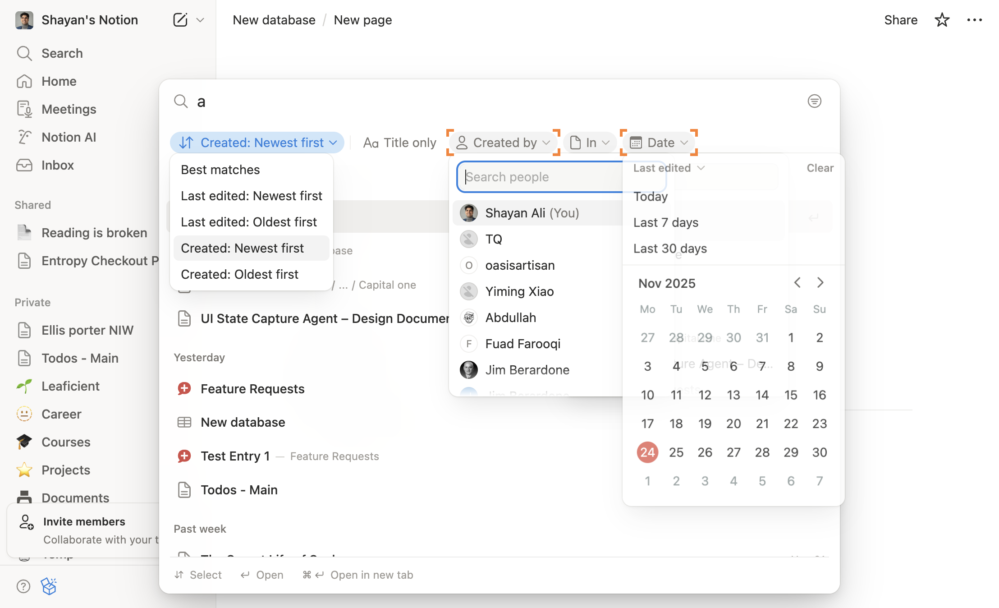

*You should see your pages rearranged in the list, with the most recently created page now appearing at the top, bringing you closer to locating your latest work.*

---

### Step 19

Click on the graphic symbol icon located in the top right corner of the page to access additional options for viewing your content.

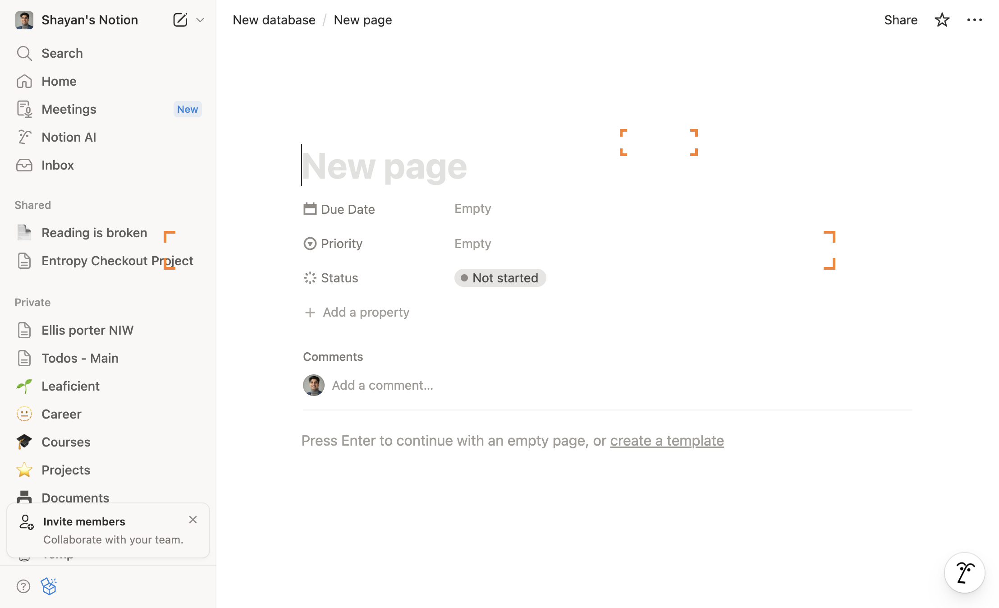

*You should see a dropdown menu appear, allowing you to further refine your view of the pages, bringing you closer to locating your most recently created page.*

---
