# How to how can i create a database in notion

**Status:** timeout
**Total Steps:** 19

---

## Instructions

Follow these steps to complete the task:

### Step 1

Click on a link to navigate

*You should now be on notion.so*

---

### Step 2

Click on 'New database'

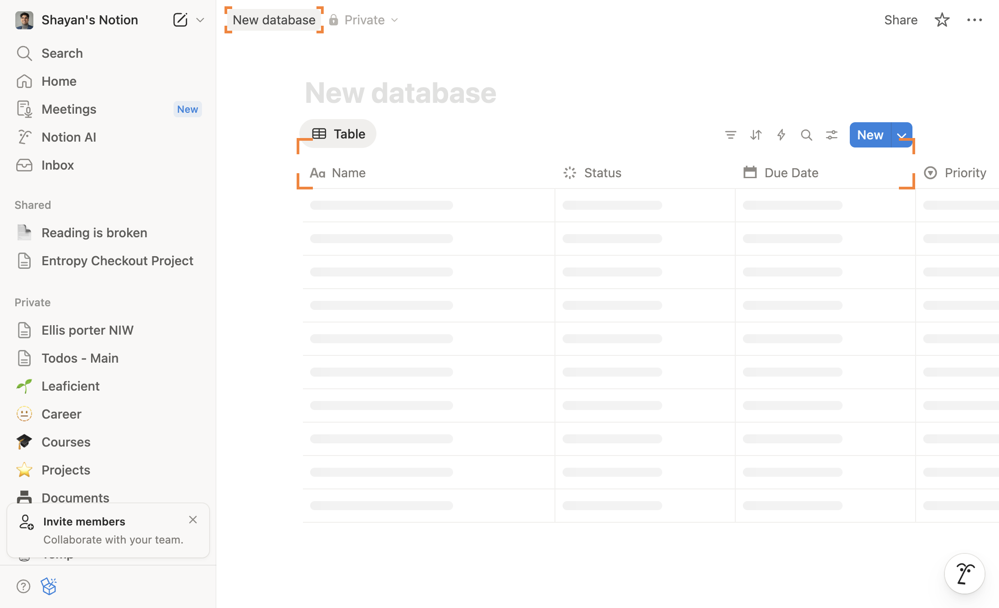

*You should now be on notion.so*

---

### Step 3

Click on a link to navigate

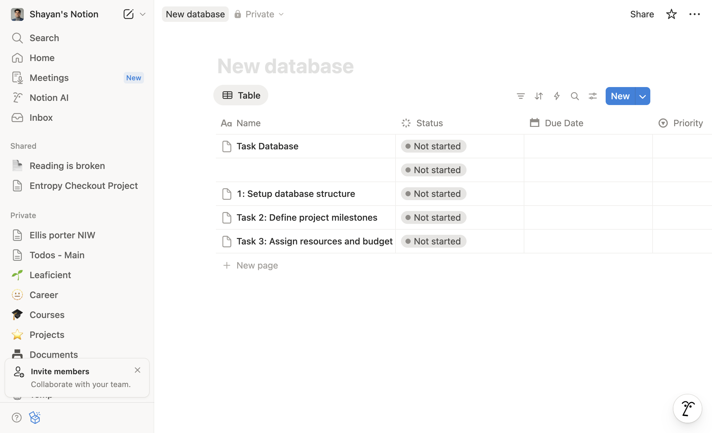

*You should now be on notion.so*

---

### Step 4

Click on 'Priority'

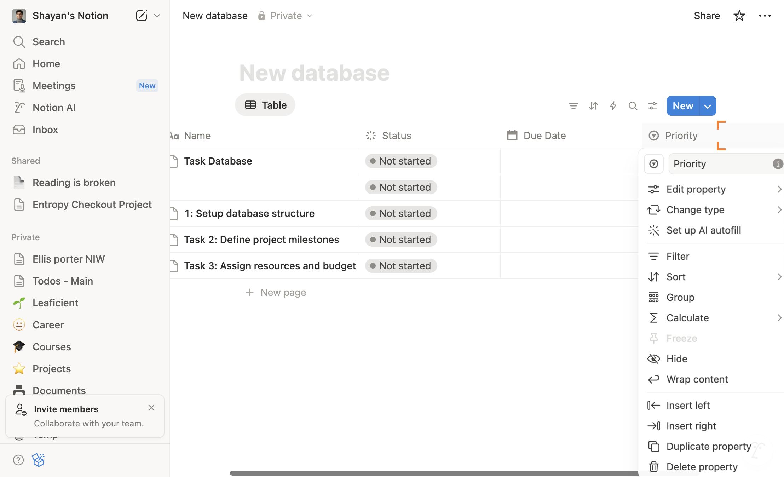

*You should now be on notion.so*

---

### Step 5

Click on 'Insert right'

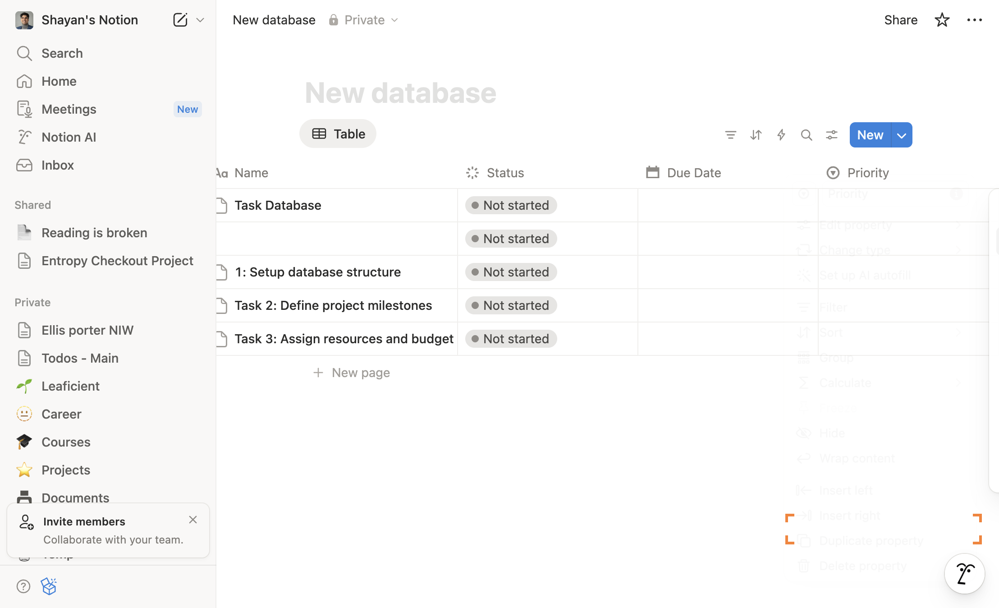

*You should now be on notion.so*

---

### Step 6

Click on 'Person'

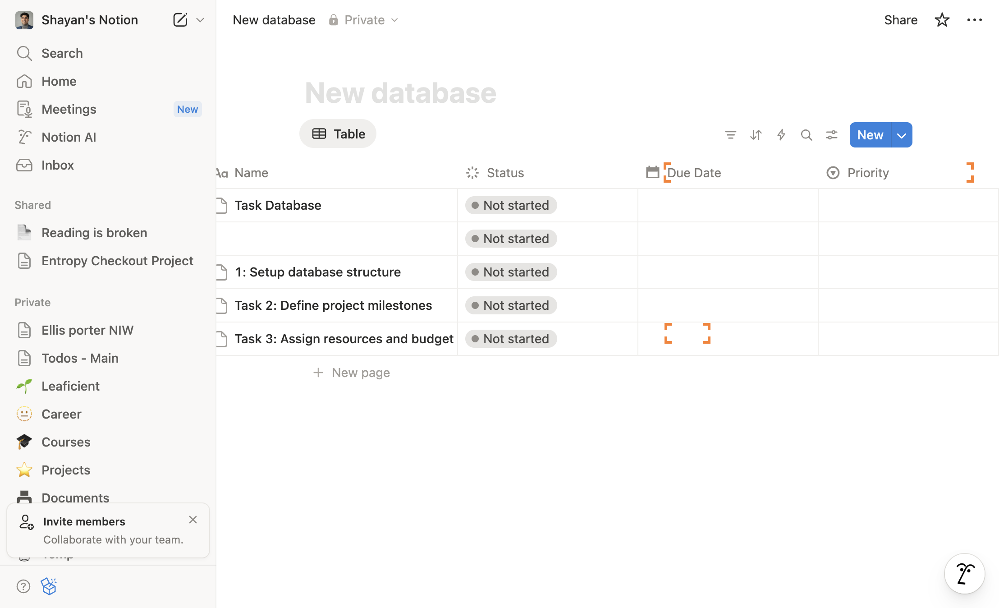

*You should now be on notion.so*

---

### Step 7

Click on 'Priority'

*You should now be on notion.so*

---

### Step 8

Click on 'Insert right'

*You should now be on notion.so*

---

### Step 9

Click on 'Files & media'

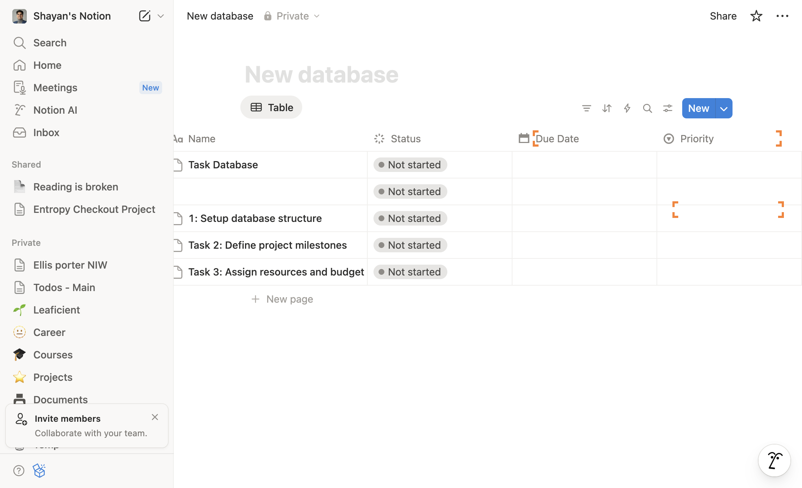

*You should now be on notion.so*

---

### Step 10

Click on 'Priority'

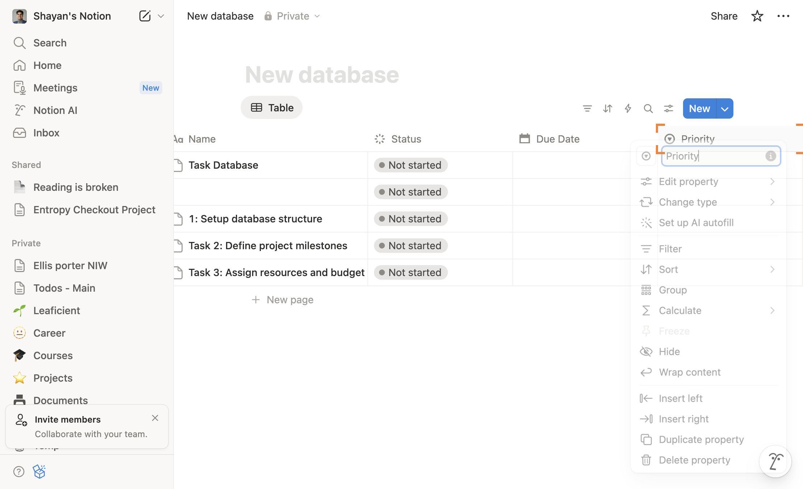

*You should now be on notion.so*

---

### Step 11

Click on 'Insert right'

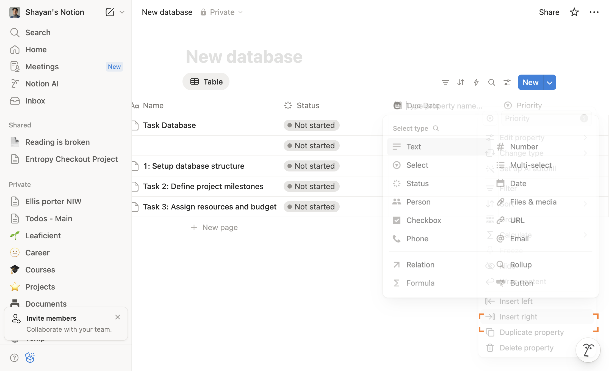

*You should now be on notion.so*

---

### Step 12

Click on 'Number'

*You should now be on notion.so*

---

### Step 13

Click on 'New page'

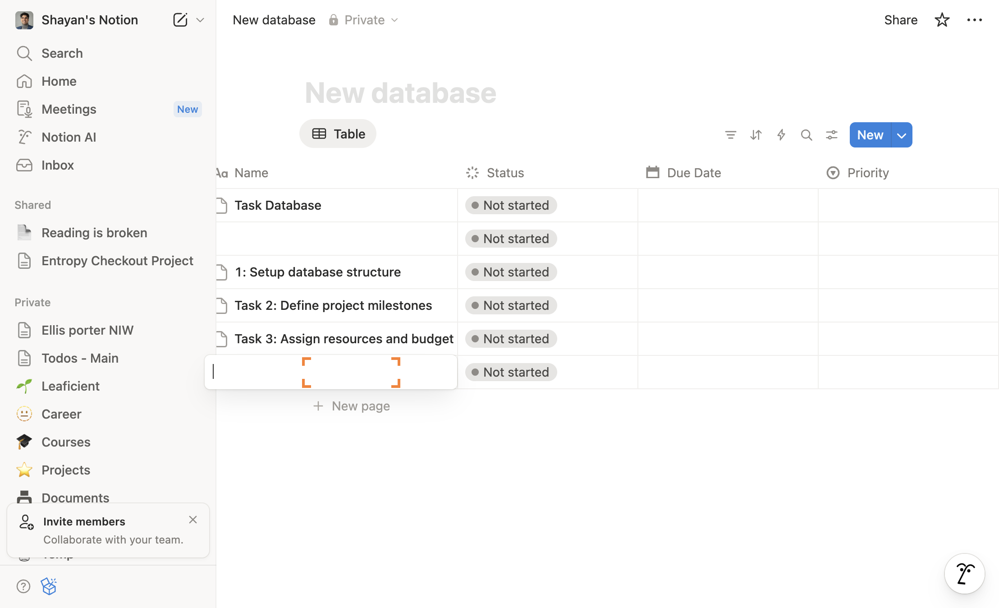

*You should now be on notion.so*

---

### Step 14

Type 'Task 4: Review and Submit'

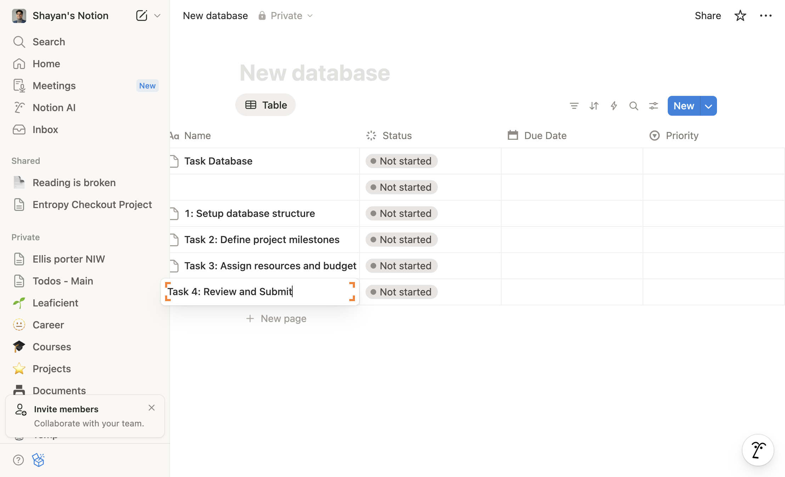

*You should now be on notion.so*

---

### Step 15

Click on 'New page'

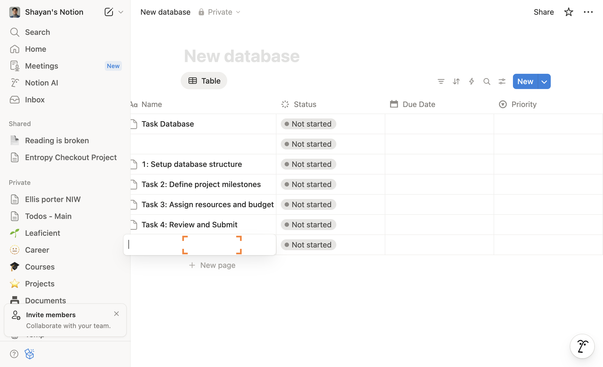

*You should now be on notion.so*

---

### Step 16

Type 'Task 5: Final Documentation'

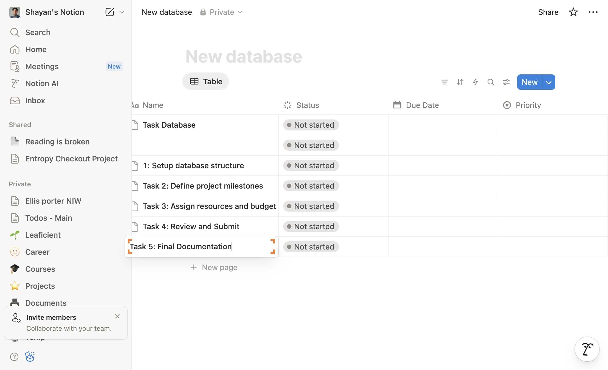

*You should now be on notion.so*

---

### Step 17

Click on 'New'

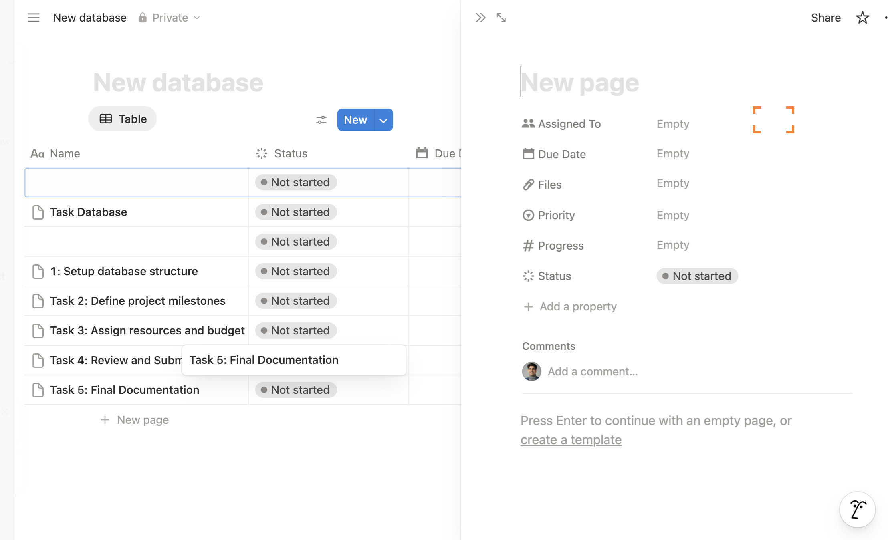

*You should now be on notion.so*

---

### Step 18

Clicked div role=button aria-label=Settings

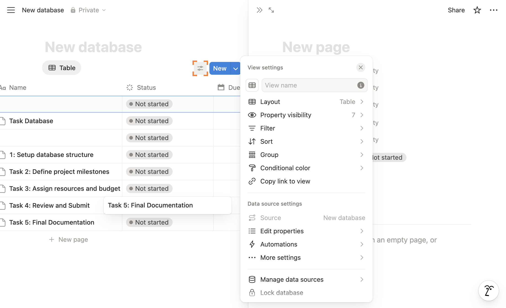

*You should now be on notion.so*

---

### Step 19

Click on 'Layout
Table'

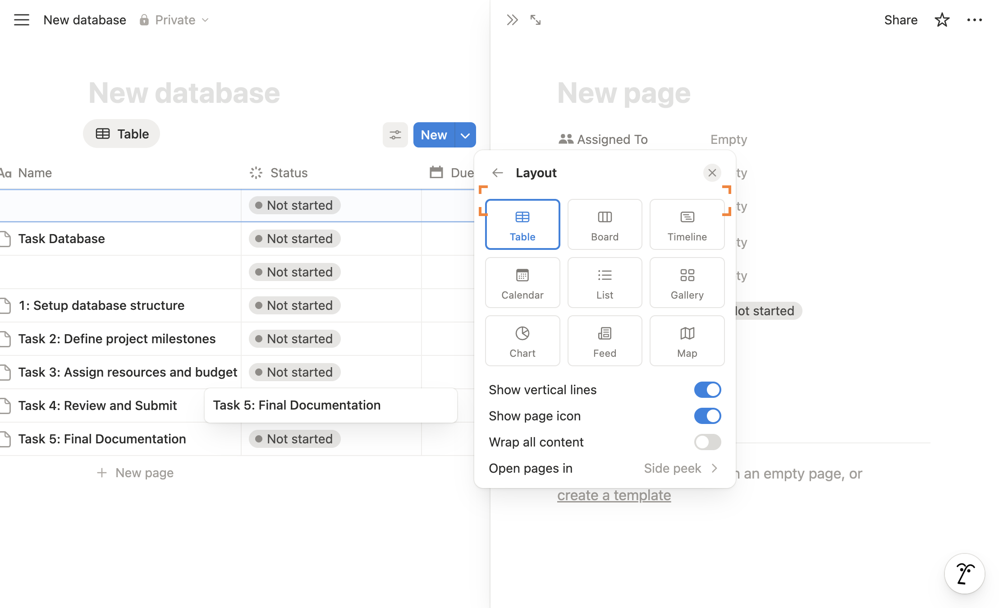

*You should now be on notion.so*

---
