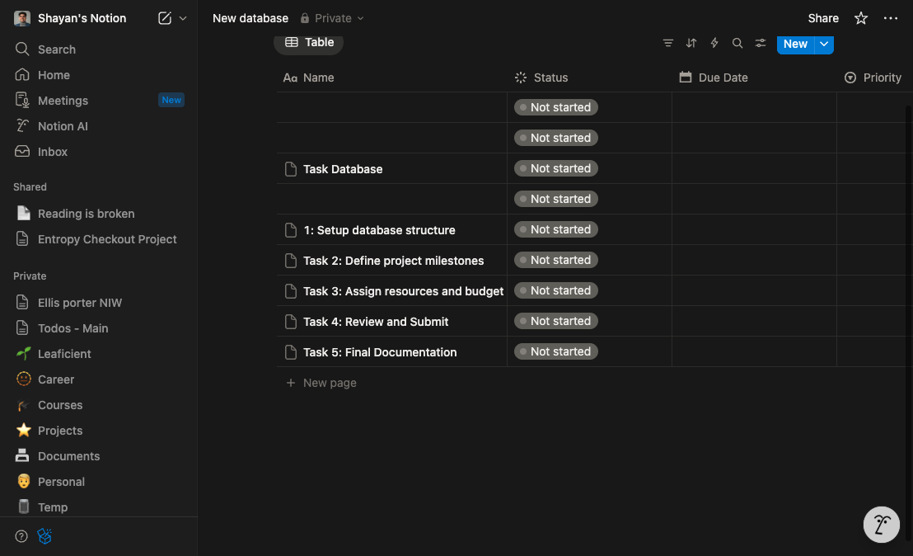
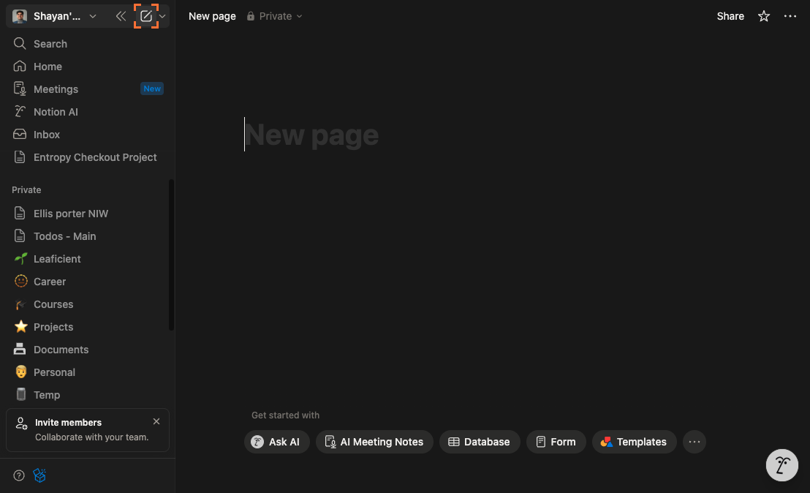
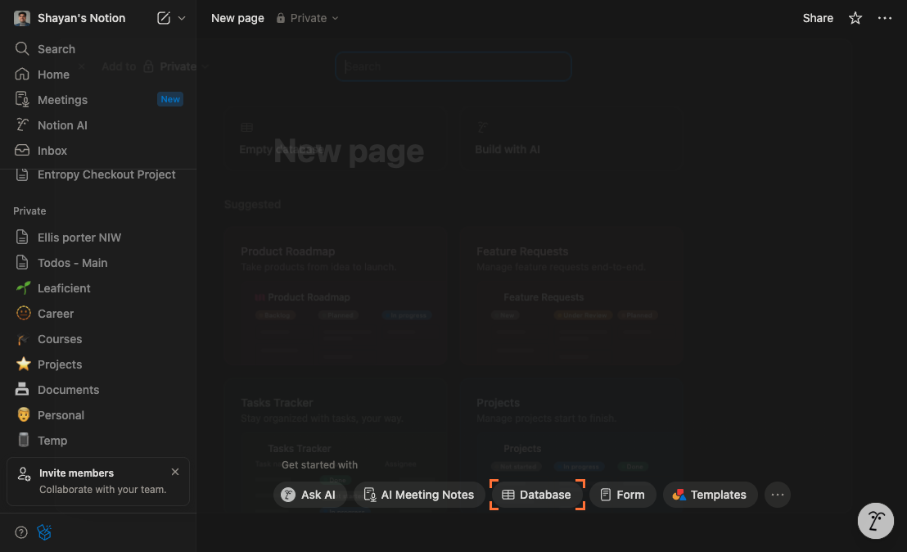
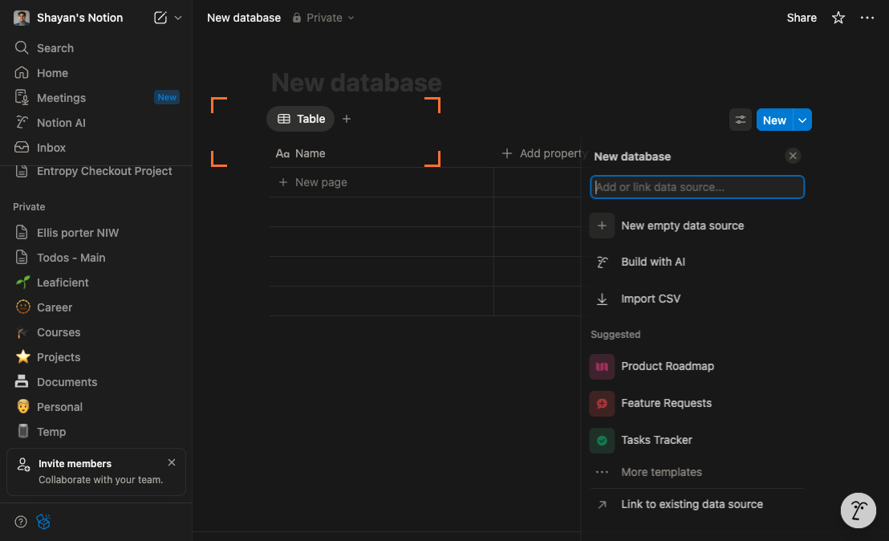
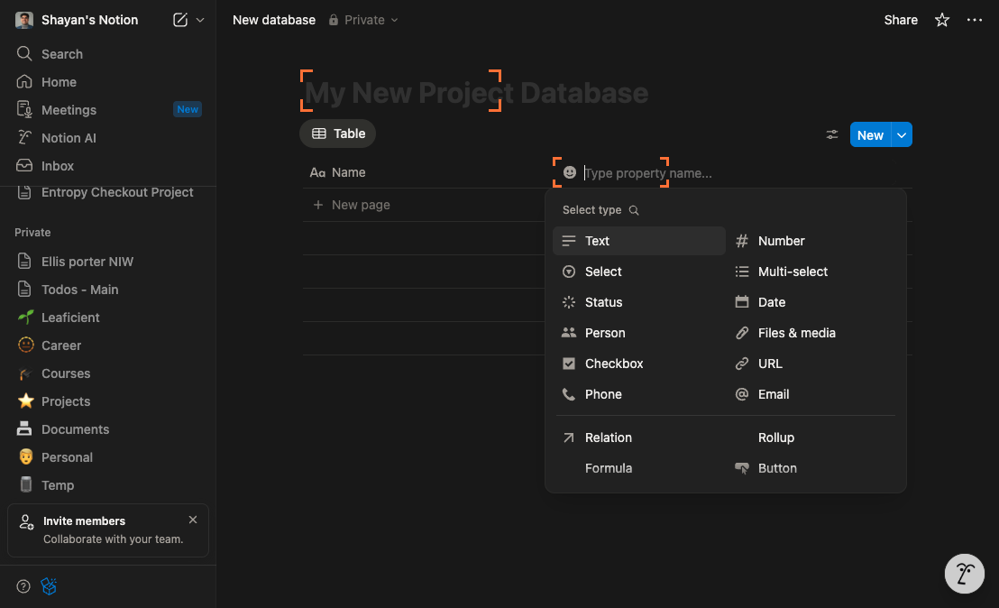
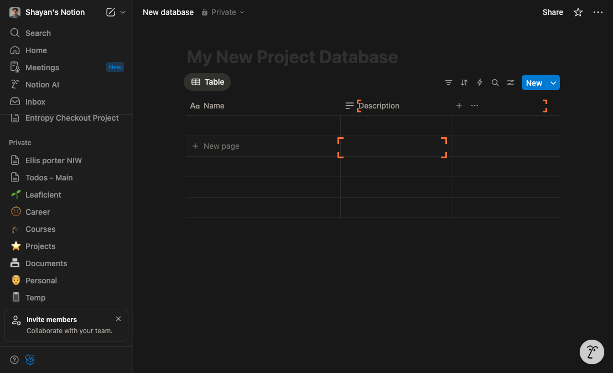
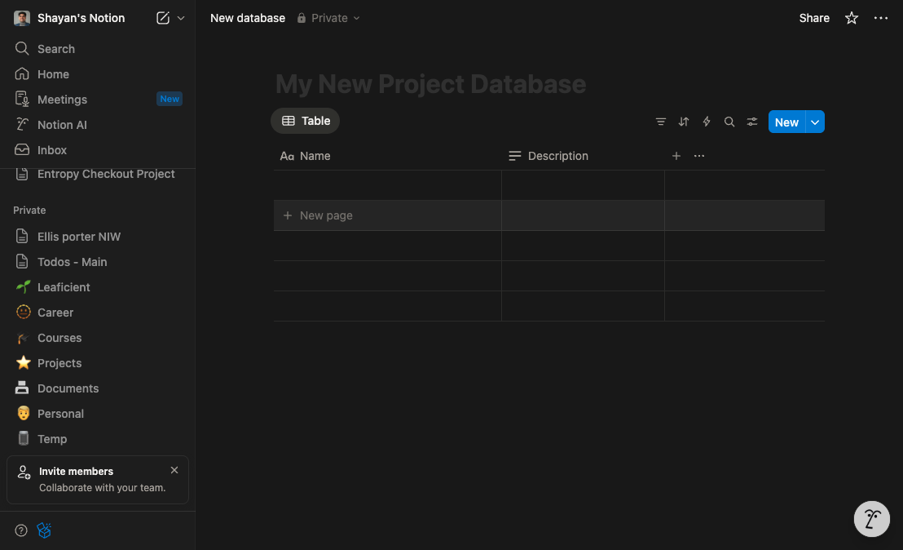

# How to how can i create a database in notion

**Status:** success
**Total Steps:** 7

---

## Instructions

Follow these steps to complete the task:

### Step 1

Now that you’re on Notion, click the “+ New page” button in the left sidebar to create a new page where your database will live, so you can choose a database layout next.

*A blank page opens with a title field at the top and a setup panel showing a Databases section with options like “Table – Full page” and “Board – Full page,” indicating you’re one step closer to creating your database.*

---

### Step 2

Now that you’re in your Notion workspace, click the “New page” button in the left sidebar to open a fresh page where you’ll add your database, creating a dedicated space to hold it.

*A new page opens with an “Untitled” title field at the top and a template picker in the main area showing options like “Table – Full page” and “Board – Full page,” moving you closer to creating your database.*

---

### Step 3

In the new page setup panel that opened after clicking 'New page', click the 'Database' option in the template menu on the right to start creating a database and choose its layout.

*A selection grid of database layouts appears in the main area with tiles labeled Table, Board, List, Calendar, Gallery, and Timeline—confirming you’re now choosing the structure for your new database.*

---

### Step 4

Now that you've opened the database creation menu, click the card labeled 'Empty database' in the template options panel to create a blank database you can customize.

*A new blank database page opens showing a table-style view with column headers (e.g., Name, Tags) and an empty first row—confirming you're one step closer to creating your database.*

---

### Step 5

Now that your empty database is open, click the “+ Add a property” button at the far right of the column header row to add a new column, which will let you define another field such as Status or Due date.

*A small property menu opens with a name field and type options (Text, Number, Select), and an untitled column appears in the table—you're now one step closer to building your database structure.*

---

### Step 6

In the property type menu that opened beneath the database header after clicking 'Add property', click 'Text' to set this new column to store plain text entries.

*A new column appears in the database header with 'Text' shown as its type and blank cells beneath it, indicating you can start typing—you're one step closer to creating your database.*

---

### Step 7

Now that you’ve added a Text property, rename it for clarity: click the new column header labeled "Text" at the top of the table, select "Rename" from the dropdown, and type "Notes" to define what this column will store.

*The table updates to show a "Notes" column header to the right of "Name," confirming the new property is added and clearly labeled—putting you one step closer to a well-structured database.*

---
