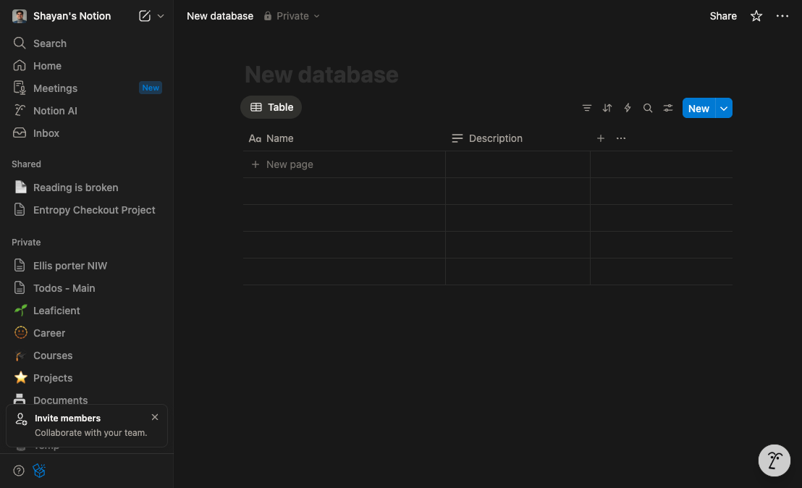
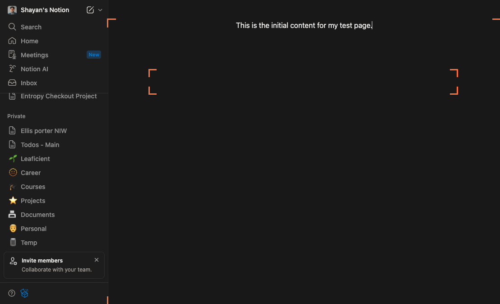
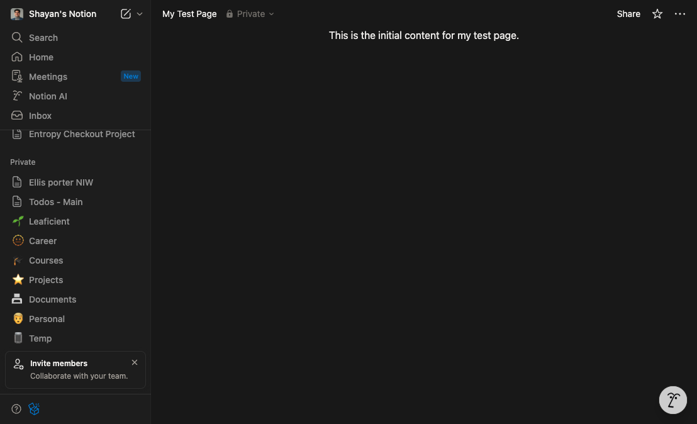

# How to How can I create a new page in Notion?

**Status:** success
**Total Steps:** 4

---

## Instructions

Follow these steps to complete the task:

### Step 1

In the left sidebar, scroll through your page list until the 'New page' button is visible in order to reveal the page-creation control.

*The list of pages moves and a 'New page' button with a plus (+) icon becomes visible in the sidebar, moving you closer to creating your page.*

---

### Step 2

Click the 'New page' button in the left sidebar to create a blank page, which will open in the main content area.

*A blank page opens in the main area with 'Untitled' at the top, 'Add icon'/'Add cover' controls, and a faint "Type '/' for commands" hint—you're now on the new page.*

---

### Step 3

In the body of the new page beneath the title, type 'This is the initial content for my test page.' to add your first block of content.

*The sentence appears as a text block under the title, and an 'Edited just now' autosave indicator confirms your changes—your page now has content.*

---

### Step 4

Look at the left sidebar to confirm your new page appears in the list, in order to verify it was created and saved.

*In the sidebar, the new page is listed with a page icon and a bold title (e.g., 'Untitled' if you haven't renamed it), confirming the page has been created.*

---
