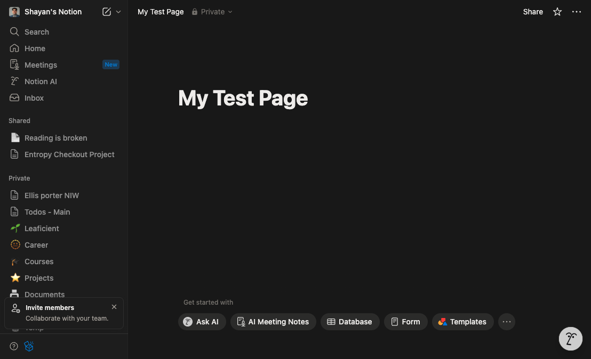
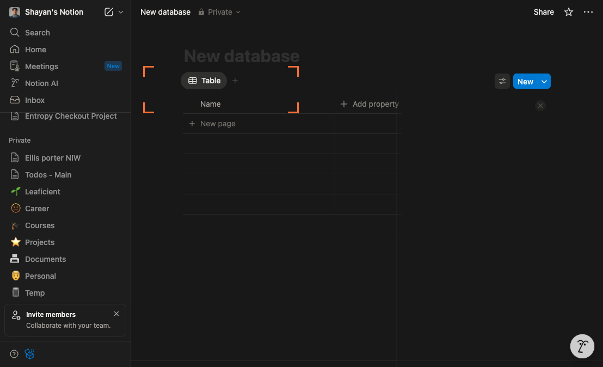
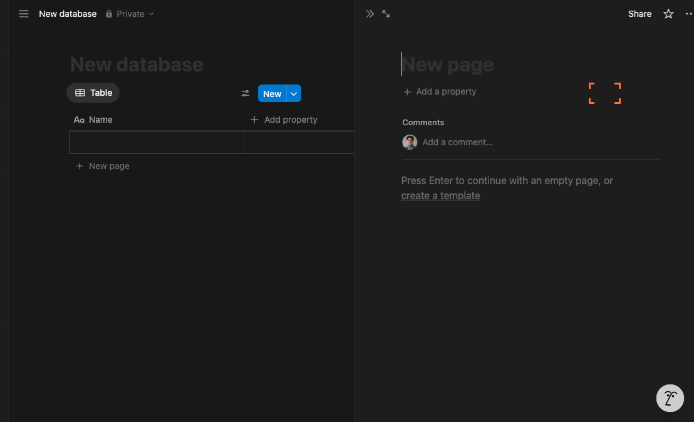
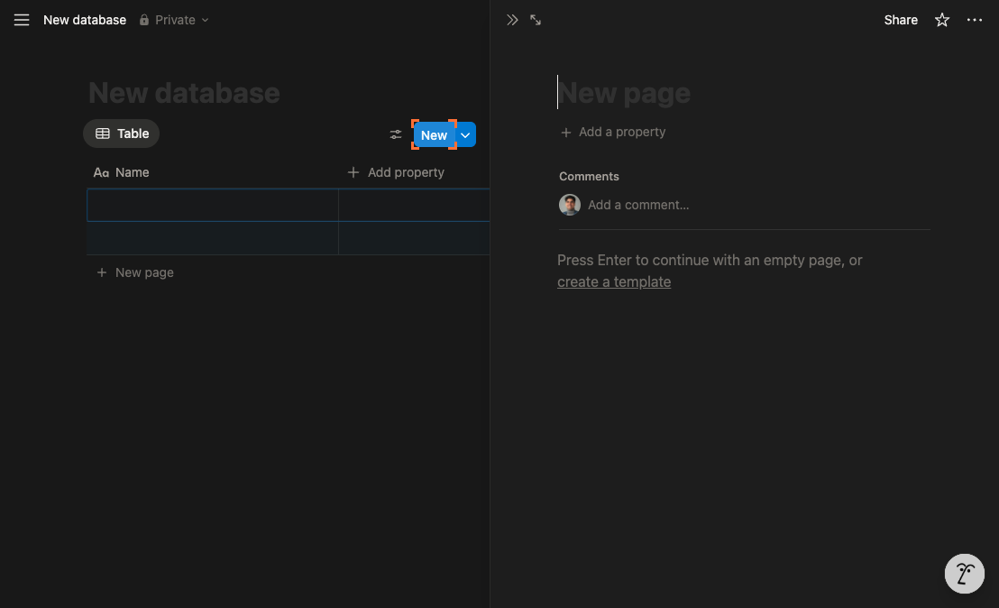
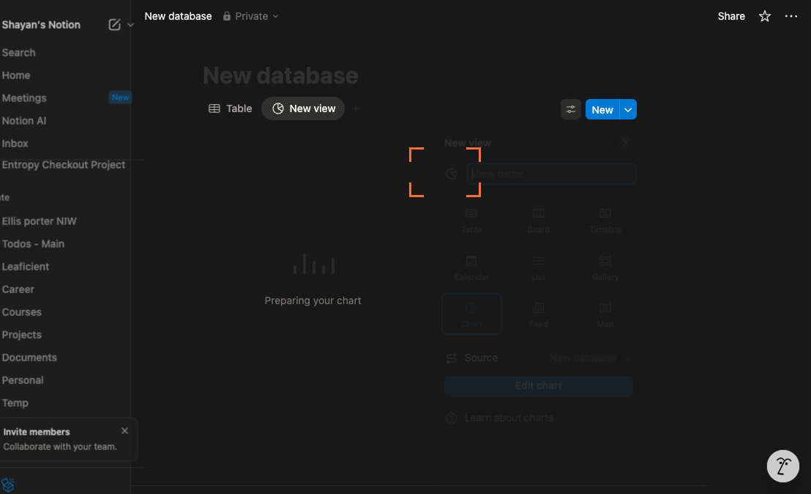

# Create a New Database with a Chart View in Notion

This tutorial will show you how to create a new database in Notion, add a few entries, and switch to a Chart view to visualize your data. You’ll learn where to find the right controls, what to click, and what to expect on screen at each step.

---

## Step 1 — Open the destination page in your workspace
- In the Notion sidebar, navigate to the page where you want to create your database.
- This ensures you’re adding the database in the right place.

What to expect: You should see the target page open and ready for editing.

---

## Step 2 — Create a new page
- In the left sidebar, click the New page button (look for “New page” near the bottom of the sidebar).
- This creates a dedicated space for your database and chart.

What to expect: A blank page opens with options for what to add to the page.

---

## Step 3 — Insert an empty database
- On the new page, choose the Empty database option from the database templates list.
- This starts you with a basic table you can customize.

What to expect: A table-style database appears with default columns like Name and possibly Tags.

---

## Step 4 — Add your first entry
- In the database toolbar (above the table), click the New button to add a new row.
- Adding entries gives your chart something to visualize.

What to expect: A new row appears. You can type a title in the Name column and fill any other properties.

---

## Step 5 — Add at least one more entry
- Click the New button again to create another row.
- Multiple entries help charts display meaningful comparisons.

What to expect: You should now see at least two rows in the table. If you plan to plot values (like sales or hours), consider adding a Number property and filling it for each row.

---

## Step 6 — Switch the database view to Chart
- In the database’s view toolbar (at the top-left of the database), open the view type menu and choose Chart.
- This changes the table to a visual chart of your data.

What to expect: The database switches to a chart. If prompted, configure the chart:
- Choose a chart type (bar, line, pie).
- Set what to measure (e.g., a Number property or Count of rows).
- Optionally Group by a property (e.g., Tags) to compare categories.

Tip: If the chart looks empty or minimal, make sure your database has data and, for most chart types, at least one Number property with values.

---

## Summary

You created a new page, inserted an empty database, added entries, and switched the view to Chart to visualize your data. Continue refining the chart by adding Number, Select, or Date properties, then adjust the chart’s measure, grouping, and type to highlight the insights you need.