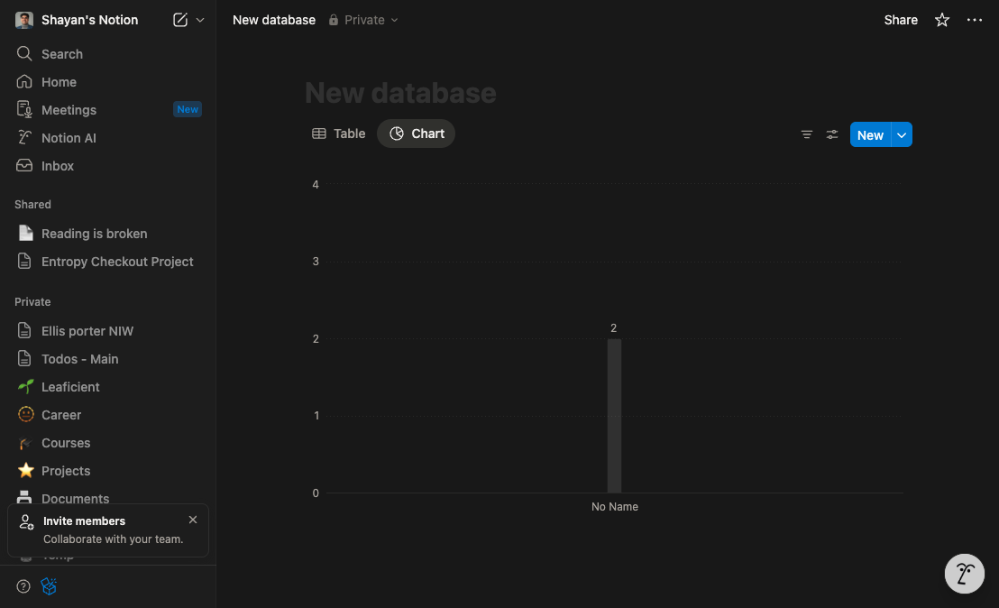

# Create a New Database With a Chart View in Notion

This tutorial walks you through creating a new database on a fresh page and adding a chart view so you can visualize your data at a glance. You’ll set up basic properties, then configure the chart to show the metrics that matter.

## Step 1: Create a database page and add a Chart view

- In the left sidebar, click the New page button to start a blank page.  
  What you should see: A new page canvas with a title field at the top and a content area below.

- Give the page a clear name in the title field at the top (for example, “Project Metrics”).

- In the page body, create a full-page database:
  - Choose Database options and select Table – Full page (or any database format you prefer, such as List or Board).
  - What you should see: A database with a header toolbar (New, Filter, Sort, Search) and default properties like Name.

- Add or adjust properties your chart will use:
  - Add a Number property (for values to plot, such as “Budget” or “Hours”).
  - Optionally add a Select or Multi-select property (for grouping, such as “Status” or “Team”).
  - Optionally add a Date property (if you want to visualize trends over time).

- At the top left of the database, click the + Add a view button to open the view picker.

- In the view picker modal:
  - Choose Chart as the view type.
  - Name the view (for example, “Overview Chart”).
  - Select a chart type (Bar, Line, or Pie).
  - Configure data:
    - Set the Y-axis to your Number property (for example, “Budget”).
    - For Bar/Line charts, set the X-axis or Group by option (for example, “Status” or a Date interval).
    - For Pie charts, set the Segment by option (for example, “Team”).
  - Click Create to add the chart view.

- Refine the chart using the view toolbar:
  - Click Filter to include only relevant entries (for example, Status is “Active”).
  - Click Sort to order bars or lines by a property (for example, highest Budget first).
  - Use the view tabs at the top to switch between your Chart and Table views.

What you should see:
- A new chart tab alongside your default Table view.
- A chart that reflects your chosen properties (bars, lines, or slices sized according to your Number property).
- Clear labels and groupings based on the properties you selected.

## Summary

You created a new page, added a full-page database, and configured a Chart view to visualize your data. Use Filters, Sorts, and property settings to keep your chart focused and meaningful. Switch between the Chart and Table view tabs at the top of the database to analyze your data in different ways.