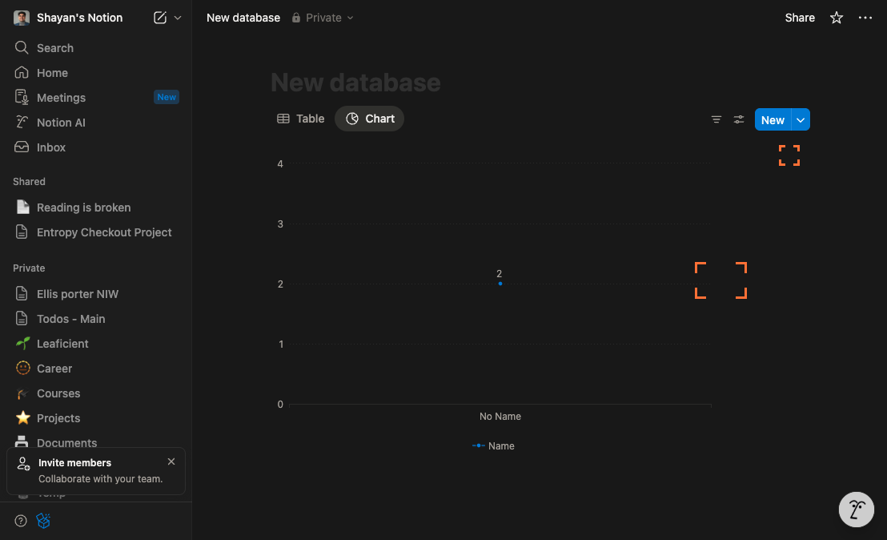
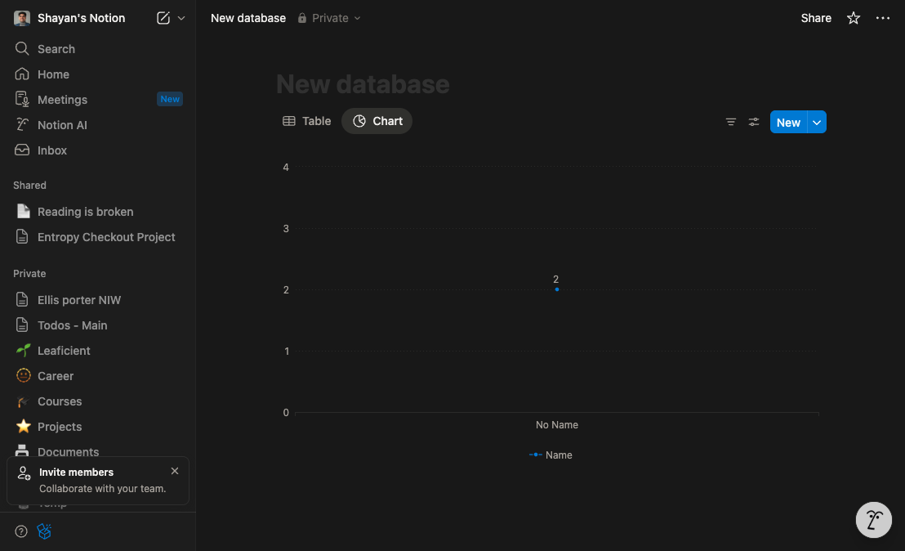

# Create a New Database With a Chart View in Notion

## Introduction
This tutorial walks you through creating a new database in Notion, adding a Chart view, and configuring it (for example, as a Line chart) so your data is visualized clearly. You’ll learn where to find the relevant controls, how to map properties to chart axes, and what to expect at each step.

---

## Step 1: Open the target page and start a new database

- In the left sidebar, open the page where you want the new database.
- Create a database:
  - Click “+ New page” (in the sidebar) or add a new block on the page and select “Database”.
  - Choose a full-page database (e.g., “Table – Full page”) or an inline database, depending on your layout needs.
- Name the database at the top where the title field appears.
- Add the properties your future chart will use:
  - For a Line chart, include a date or time property (for the X-axis) and a number property (for the Y-axis).

What you should see:
- A new database on your page with a few starter columns and your chosen title.

---

## Step 2: Open the chart view settings to add a Chart view

- In the database toolbar (at the top, under the title), open the view switcher:
  - Click the current view name (e.g., “Table”) and select “Add a view”.
  - Choose “Chart” as the view type, give the view a clear name (e.g., “Performance (Chart)”), and click “Create”.
- After the Chart view appears, open its configuration by clicking the Settings button (at the top right of the chart area).

What you should see:
- The Chart view canvas replaces the table view.
- A settings panel or configuration dialog opens for chart setup.

---

## Step 3: Close and reopen settings as needed to preview your chart

- If you want to preview how the chart looks without the settings panel, click the Close button at the top right of the settings panel.
- You can always return to settings by clicking the Settings button (top right of the chart) to continue adjusting your configuration.

Why this helps:
- Toggling the settings panel lets you quickly compare changes and ensure the chart looks right before finalizing.

What you should see:
- The chart canvas fills more of the page with the settings panel hidden; the Settings button remains accessible.

---

## Step 4: Configure the chart type and map your data properties

- Reopen the chart Settings (top right of the chart) to set up your visualization:
  - Chart type: Select “Line” for trends over time.
  - X-axis: Choose a date or time property (e.g., “Date”).
  - Y-axis: Choose a numeric property (e.g., “Amount”, “Score”, “Revenue”).
  - Aggregation (if available): Pick how values should be summarized (e.g., Sum, Average, Count).
  - Group by or Segment by (optional): Split the line by a property (e.g., “Category” or “Status”) for multiple series.
  - Filters (optional): Include only relevant records (e.g., current quarter).
  - Sort (optional): Ensure your X-axis is chronological for a clean trend line.
- Confirm changes so the chart updates with your selections.

What you should see:
- The chart updates to a Line chart, plotting your Y-axis values across the selected X-axis property, with series grouped or segmented if configured.

---

## Step 5: Finalize, name your view clearly, and verify the result

- Give the chart view a descriptive name (e.g., “Sales Trend (Line)”) in the view switcher so teammates know what it shows.
- Verify:
  - The data points and axes look correct.
  - Filters, grouping, and sorting reflect the intended dataset.
  - The chart updates when you add or edit rows in the underlying database.

What you should see:
- A working Chart view connected to your database. Adding or editing database entries automatically updates the visualization.

---

## Conclusion
You’ve created a new Notion database, added a Chart view, and configured it as a Line chart by mapping properties to the X and Y axes. Use filters, grouping, and sorting to refine your insights. You can add additional chart views (Bar, Scatter, Pie) from the same view switcher to analyze your data from different angles.