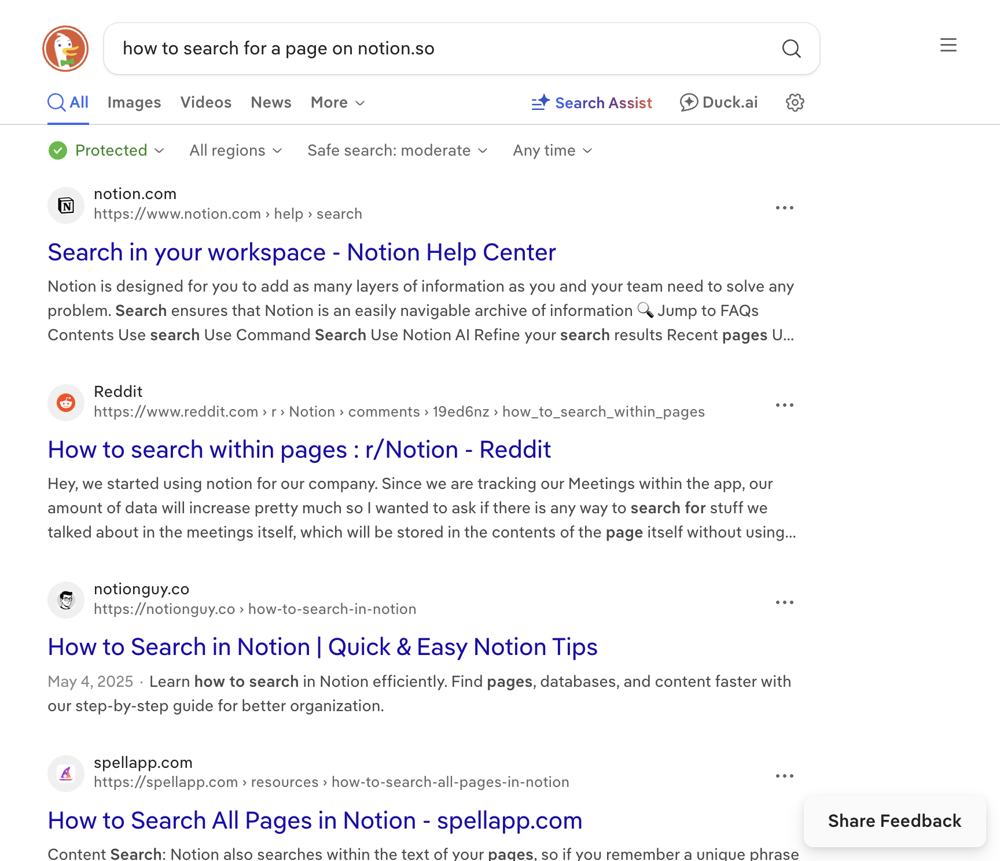
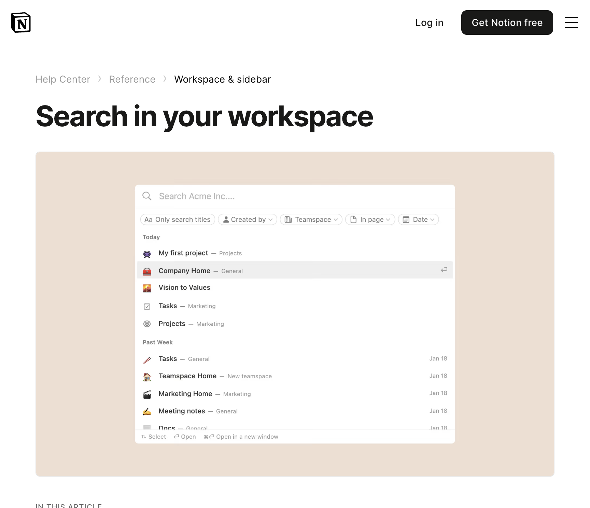

# How to How can i search for a page on notion.so?

**App:** notion
**Status:** in_progress
**Total Steps:** 3

---

## Step 1: Initial state after navigation: How can i search for a page on notion.so?

**URL:** https://www.notion.so/
**Action:** other - Executed action

---

## Step 2: After other: Executed action

**URL:** https://duckduckgo.com/?q=how+to+search+for+a+page+on+notion.so&ia=web
**Action:** other - Executed action

---

## Step 3: After other: Executed action

**URL:** https://www.notion.com/help/search
**Action:** other - Executed action

---
