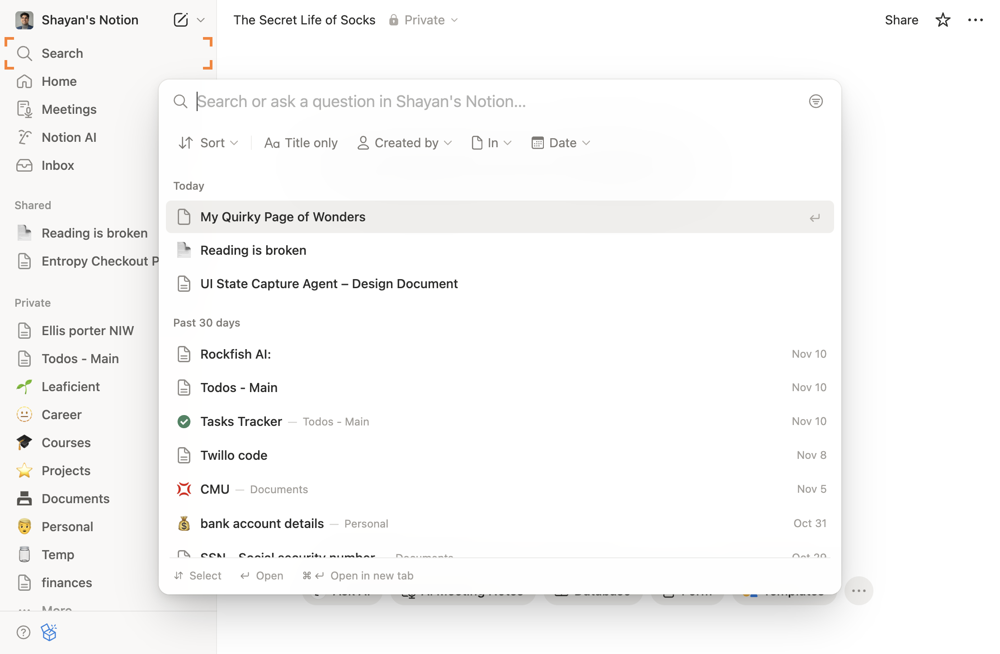
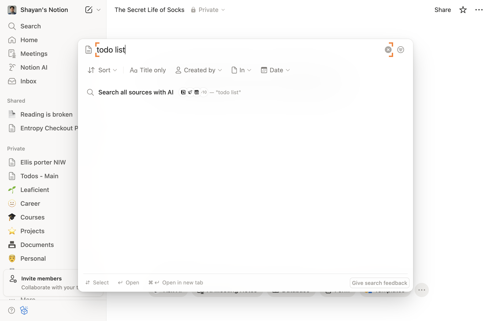
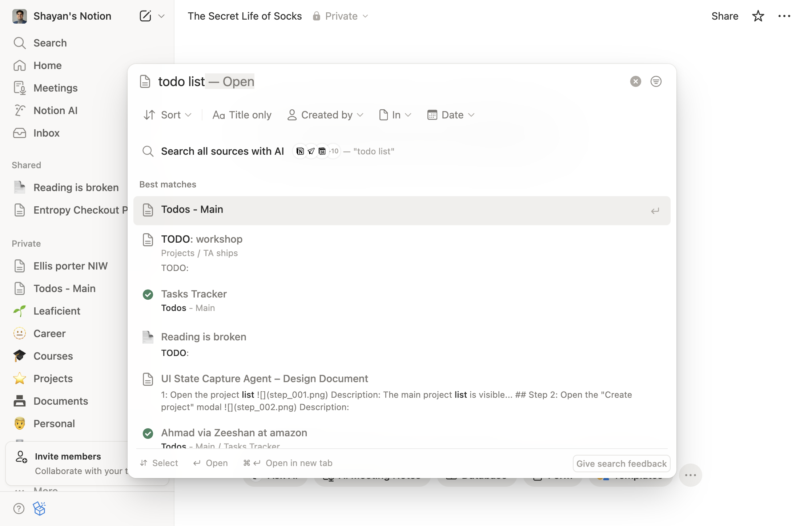
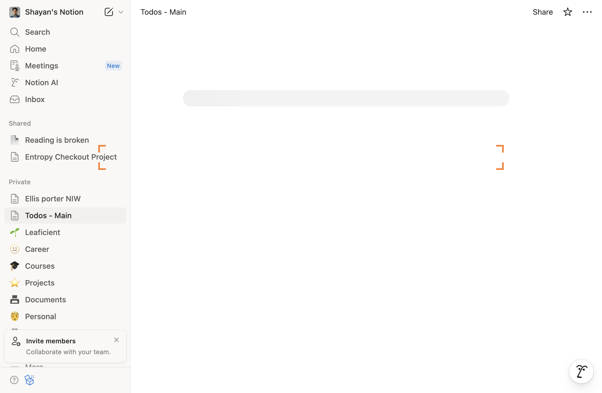
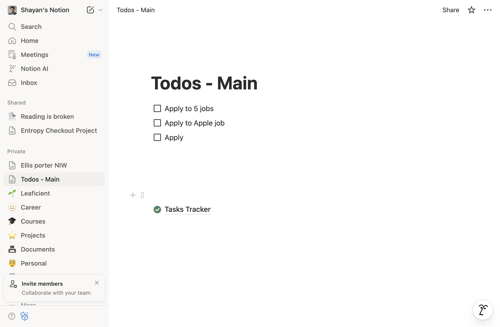

# How to Go to notion.so and serach for my todo list

**App:** notion
**Status:** success
**Total Steps:** 6

---

## Step 1: Initial state after navigation: Go to notion.so and serach for my todo list

**URL:** https://www.notion.so/
**Action:** other - Executed action

---

## Step 2: After other: Executed action

**URL:** https://www.notion.so/shayan-ali/The-Secret-Life-of-Socks-2b28b46e0fb280189b98caefa199f208
**Action:** other - Executed action

---

## Step 3: After other: Executed action

**URL:** https://www.notion.so/shayan-ali/The-Secret-Life-of-Socks-2b28b46e0fb280189b98caefa199f208
**Action:** other - Executed action

---

## Step 4: After other: Executed action

**URL:** https://www.notion.so/shayan-ali/The-Secret-Life-of-Socks-2b28b46e0fb280189b98caefa199f208
**Action:** other - Executed action

---

## Step 5: After other: Executed action

**URL:** https://www.notion.so/shayan-ali/Todos-Main-60face0c87224d78999affb4cebe3436
**Action:** other - Executed action

---

## Step 6: Task completed successfully

**URL:** https://www.notion.so/shayan-ali/Todos-Main-60face0c87224d78999affb4cebe3436
**Action:** other - Executed action

---
