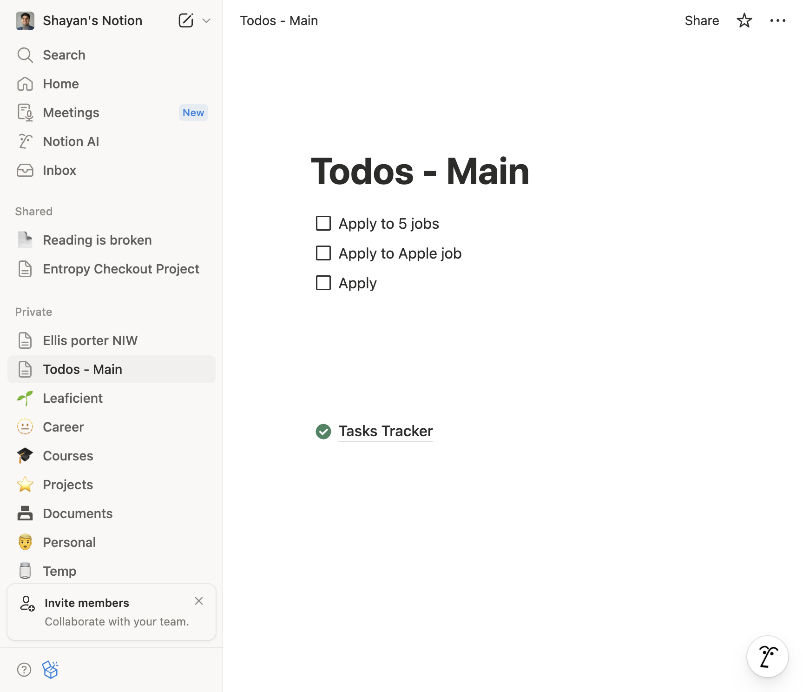
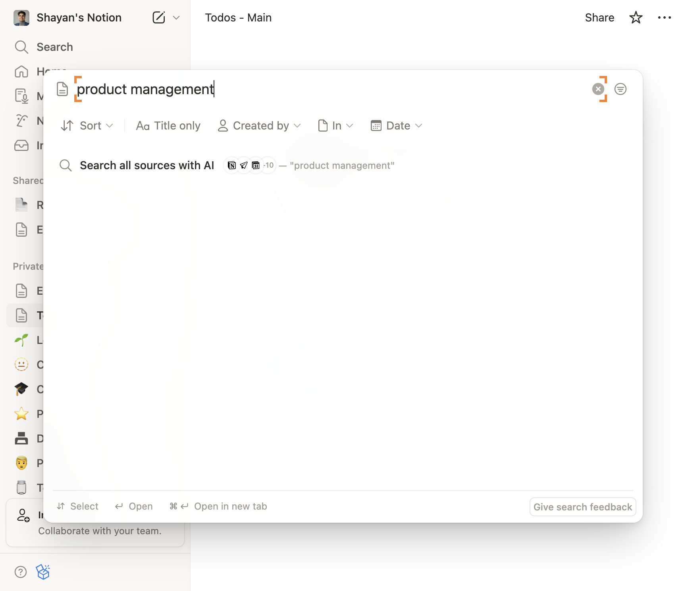
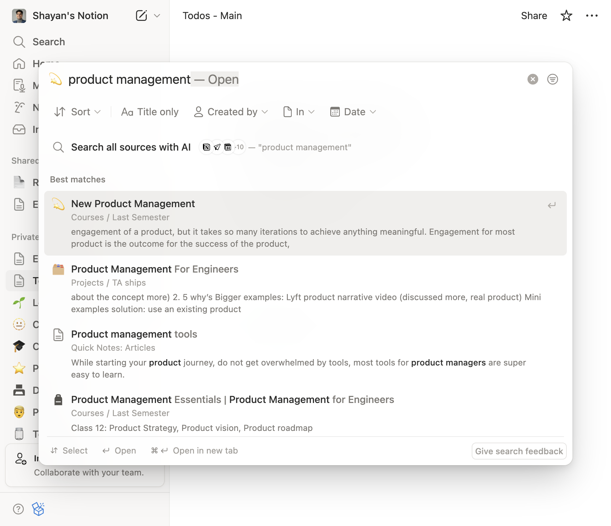
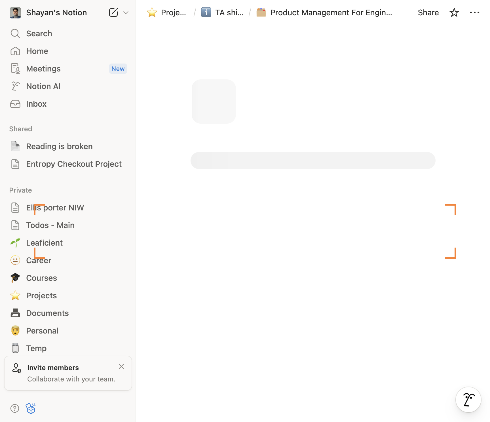
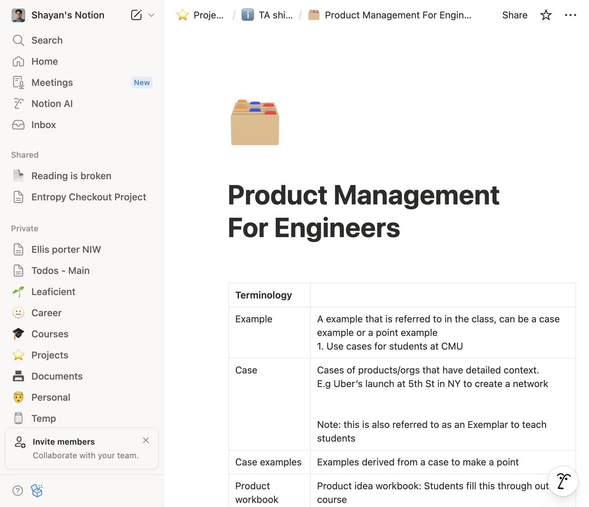

# How to Go to notion.so and serach for product management page

**App:** notion
**Status:** success
**Total Steps:** 7

---

## Instructions

Follow these steps to complete the task:

### Step 2

Execute action

*Note: You should be on https://www.notion.so/shayan-ali/Todos-Main-60face0c87224d78999affb4cebe3436*

---

### Step 3

Execute action

*Note: You should be on https://www.notion.so/shayan-ali/Todos-Main-60face0c87224d78999affb4cebe3436*

---

### Step 4

Execute action

*Note: You should be on https://www.notion.so/shayan-ali/Todos-Main-60face0c87224d78999affb4cebe3436*

---

### Step 5

Execute action

*Note: You should be on https://www.notion.so/shayan-ali/Todos-Main-60face0c87224d78999affb4cebe3436*

---

### Step 6

Execute action

*Note: You should be on https://www.notion.so/shayan-ali/Product-Management-For-Engineers-f8fff63edbb6451bb58d781bff863424*

---

### Step 7

Execute action

*Note: You should be on https://www.notion.so/shayan-ali/Product-Management-For-Engineers-f8fff63edbb6451bb58d781bff863424*

---
