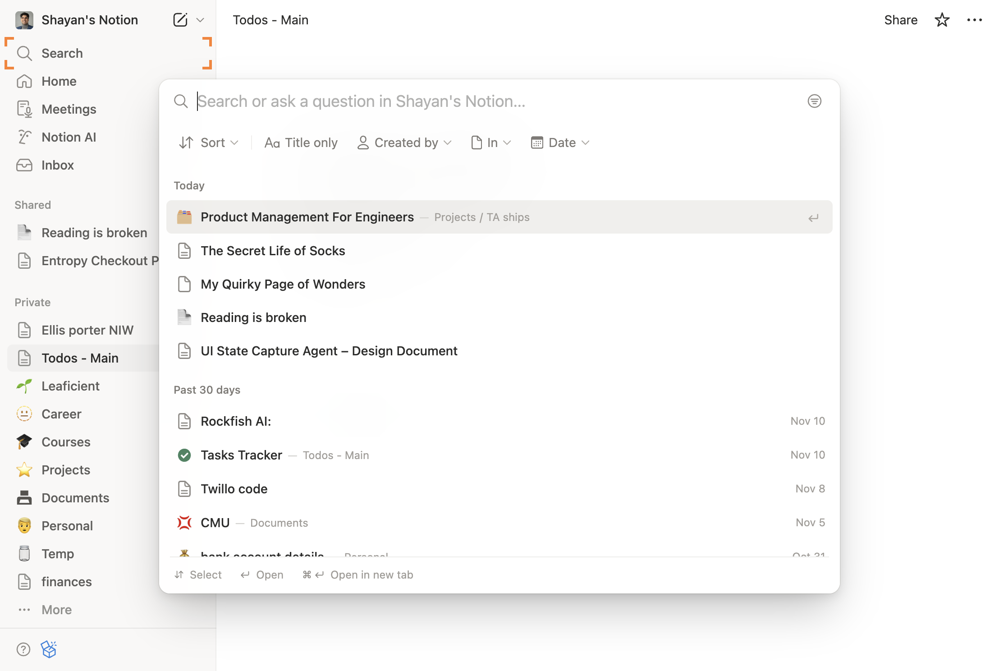
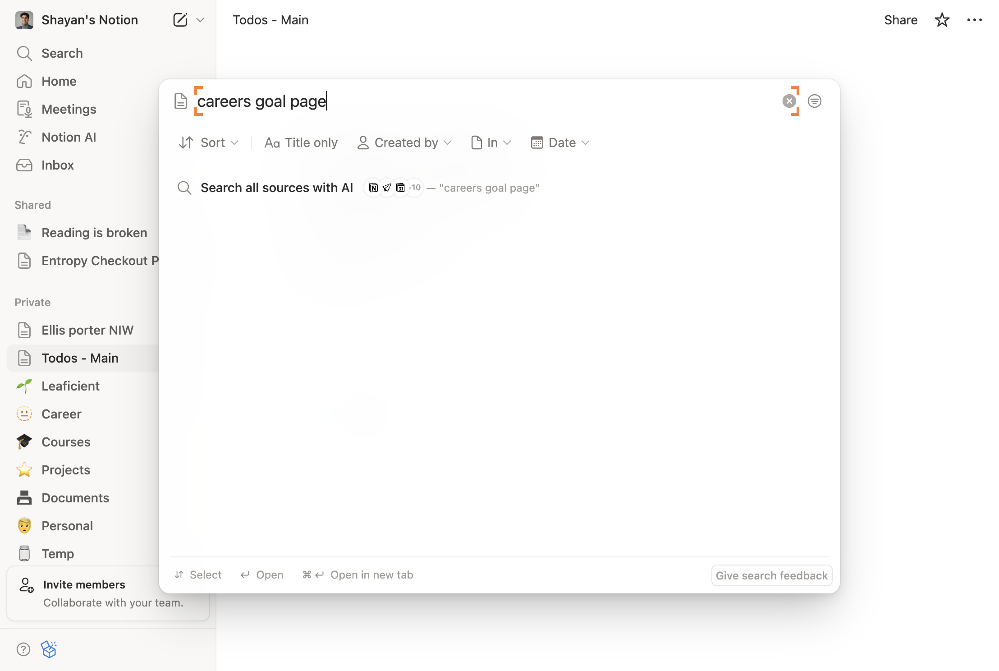
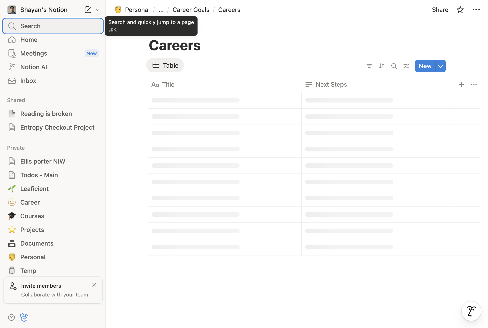
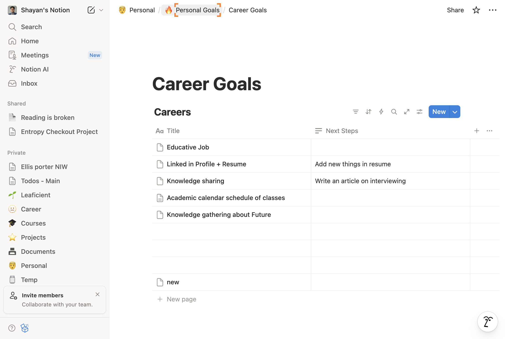

# How to Go to notion.so and serach for a careers goal page

**App:** notion
**Status:** success
**Total Steps:** 6

---

## Instructions

Follow these steps to complete the task:

### Step 2

Click on the link to open 'Todos Main 60Face0C87224D78999Affb4Cebe3436'

*You should now be on notion.so - Todos Main 60Face0C87224D78999Affb4Cebe3436*

---

### Step 3

Interact with the page

*You should now be on notion.so - Todos Main 60Face0C87224D78999Affb4Cebe3436*

---

### Step 4

Click on the link to open '138Bc3300Fac461489A1507415683B5E'

*You should now be on notion.so - 138Bc3300Fac461489A1507415683B5E*

---

### Step 5

Click on the link to open 'Career Goals D596E0778E04489E99A12A74B0Df1Ef2'

*You should now be on notion.so - Career Goals D596E0778E04489E99A12A74B0Df1Ef2*

---

### Step 6

Interact with the page

*You should now be on notion.so - Career Goals D596E0778E04489E99A12A74B0Df1Ef2*

---
